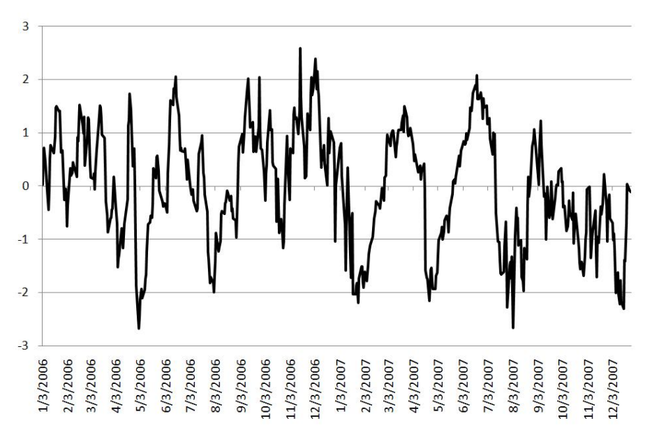
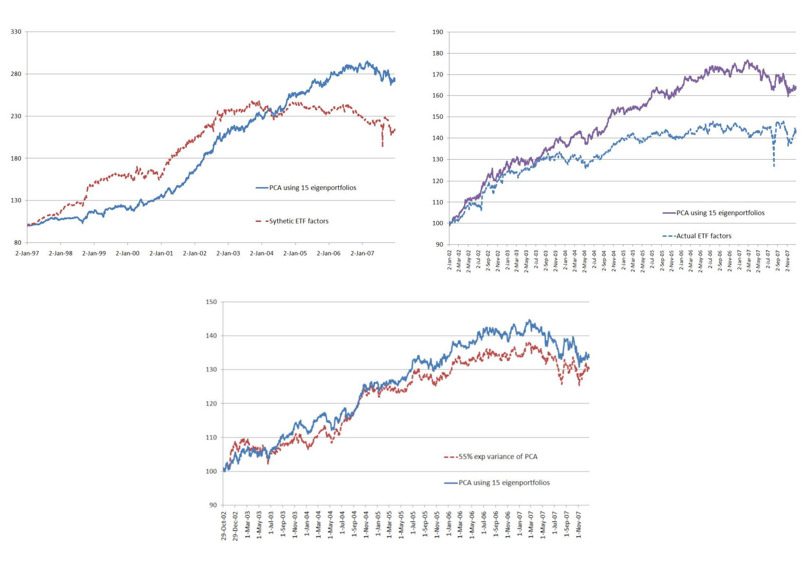
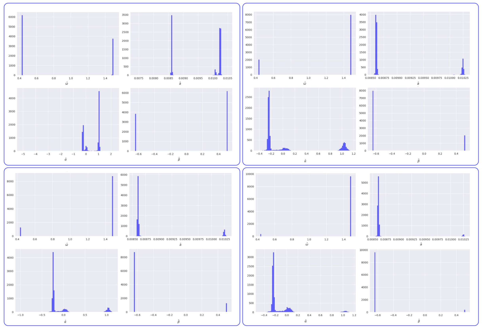
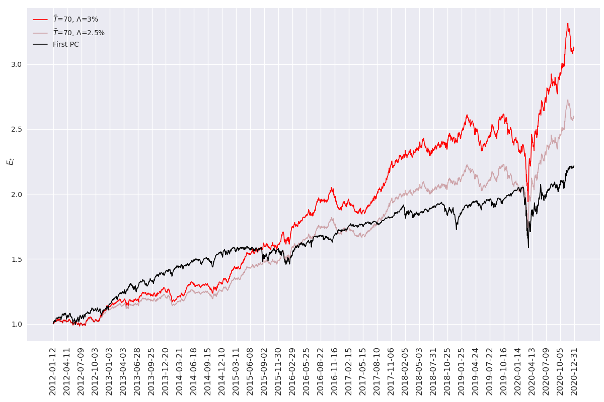
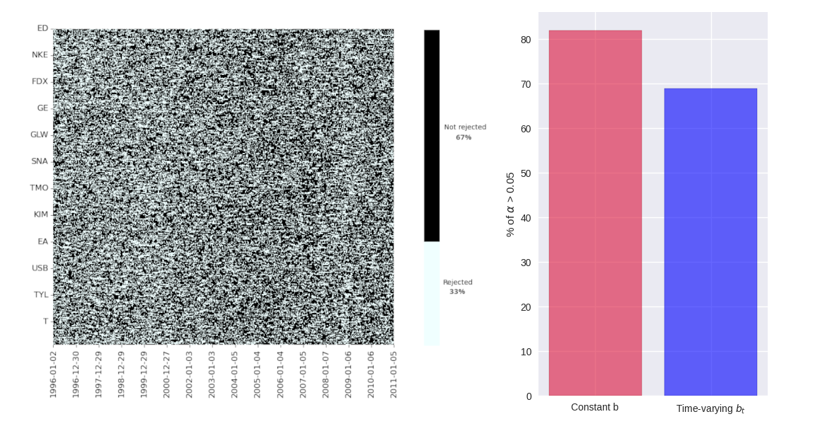

.. _main

Pair Trading
============

| The idea behind statistical arbitrage is fairly simple yet quite
  powerful. It is better explained by its ancestor pairs trading which
  is based on finding a pair of assets whose prices moved historically
  in a similar fashion and waiting until the spread between them wides.
  Then, bet on this spread buying the loser and selling the winner. This
  disarmingly simple idea shook the market in the 1980s with tremendous
  profits. There is some confusion about who first discovered it as, in
  the book *The Best of Wilmott 1: Incorporating the Quantitative
  Finance Review* [@wilmott], Paul Wilmott states that in 1982/1983
  Gerry Bamberger initiated a trading program based on pairs trading at
  Morgan Stanley, but in 1985 he departed for Princeton Newport Partners
  and retired in 1987. In addition, Wilmott claims in his book that
  pairs trading was invented at his firm in 1980. Despite these
  historical ambiguities, there is no doubt that the first ones to
  successfully deployed and formalize this idea have been the
  researchers at Morgan Stanely in 1985 under the guidance of Nunzio
  Tartaglia. They were composed of physicists, mathematicians and
  computer scientists: the so-called quants that during that time were
  flowing from their seemingly distant topics into Wall Street bringing
  with them a novel and strong quantitative approach to the market with
  the use of sophisticated statistical methods that put aside the
  fundamental analysis and trader’s intuition. The famous Morgan
  Stanley’s Black Box was born and it was going to attract the attention
  of other firms thanks to its enormous gains (Nunzio Tartaglia’s group
  reported an extraordinary 50$ million profit in 1987 [@NBERstatarb]).
  At that time the term pairs trading was not already coined, but
  rumours about the pattern used by MS began to be clear at the point
  that the suspicious behaviour adopted by the market participants about
  MS became gradually a full embrace of the firm’s actions. When Morgan
  Stanely accumulated positions on weak stocks, a lot of other
  specialists followed doing the same. Even the Securities and Exchange
  Commission (SEC) was interested in such an idea as it quickly realized
  how this technology could be employed to find potentially illegal
  price movements. The early years of pairs trading were greatly
  lucrative and the topic became a matter of research also in the
  academic world, with the paper by Gatev et al. [@NBERstatarb] being
  the first extensive academic research on the topic. In their updated
  work of 2006, Gatev et al. constructed a pairs trading strategy based
  on CRSP data over the period 1962 to 2002, finding returns of the
  order of 1% per month that survive also to conservative transaction
  cost assumptions. Unfortunately, as the Oracle in the Matrix movies
  says, everything that has a beginning has an end. Even if it is not so
  definitive (if it did, this thesis would be pointless), one of the
  fascinating aspects of the market is that it reacts dynamically to the
  actions of the participants to eliminate arbitrage opportunities as
  more traders exploit them. This is apparently what has happened to
  pairs trading, as profits started to become more and more difficult to
  earn also due to the increasing efficiency of the market with the rise
  of high-frequency trading. Do and Faff [@dofaff] extended the time
  horizon of Gatev et al. to 2008, finding a decline of returns of the
  order of 60% in the period 2002-2008. Hence, twenty years later the
  Morgan Stanley’s Black Box, pairs trading, that in the meantime
  evolved into the broader field of statarb (abbreviation for
  statistical arbitrage, a term that I will use from now on to refer
  also to pair trading) in which one asset is traded against a pool of
  other assets instead of just one, has lost his prime attraction. The
  mid-2002 and subsequent years were so the beginning of the dawn of
  statistical arbitrage strategies due to the important market changes:
  the traditional contrarian strategies had no longer the old great
  returns and more complex models were needed in order to cope with the
  new electronic trading era in which also retails can easily access to
  such algorithmic strategies. It is in this scenario that the present
  thesis tries to find its place, using modern models to improve the
  performance of one of the classical strategies utilized in the
  statistical arbitrage framework, namely the one treated in the work of
  Avellaneda et al. [@avellanedalee].
| The chapter starts with an overview of the present state of the art of
  statarb literature, then it explains the concept of overreaction in
  the stock market and ultimately it disentangles some basic results of
  Principal Component Analysis and Random Matrix Theory.

Main ideas behind statistical arbitrage
---------------------------------------

Generally speaking, the common features in all the statistical arbitrage
strategies are: (i) trading signals are rules-based, meaning that they
are not driven by fundamentals factors  [1]_, (ii) portfolios returns
are market-neutral, meaning that they are uncorrelated with the market,
being affected only by idiosyncratic factors and (iii) the procedure to
generate excess returns is statistical. These strategies can be divided
into two main tasks: in the *formation period*, one finds pairs/pools of
assets whose prices moved similarly in the past and then in the *trading
period* one chooses a set of rules to trigger the trades on those
assets. The formation period is of fundamental importance for these kind
of strategy to work appropriately, especially from a risk management
view. For instance, it is intuitive that assets that are exposed to the
same risks and opportunities, as the ones in the same industry sector,
are more prone to be good candidates in the pool/pair formation.
Instead, finding just comoving assets in a certain time horizon can lead
to spurious results if there is no other information that supports that
choice.

As Christopher Krauss outlines in his review on statistical arbitrage
[@christopherkrauss], the recent literature about the topic can be
divided into five major streams:

1. **Distance approach**: It represents the most researched pair trading
   framework, being the one used in Gatev et al. [@NBERstatarb] and in
   Do and Faff [@dofaff]. As the name suggests, it is based on distance
   metrics to find comoving assets. One of the most utilized ones is the
   sum of squared differences between the two normalized prices  [2]_ of
   assets A and B over the formation period:

   .. math::

      D = \sum_t \left( p_t^A - p_t^B \right)^2.
      \label{distanceapproach}

   A good set of pairs are the ones that minimize :math:`D`. Once the
   pairs are constructed, the trading period is based on non-parametric
   thresholds that trigger trading signals. This approach is simple and
   straightforward to implement, giving consistent results across
   different markets and time frames. Its nature of model independence
   has both advantages and disadvantages, as it is not prone to model
   mis-specification or mis-estimation, but it can not give any
   information about future forecasting or dynamics characteristics as,
   for example, typical time of convergence of the two assets.

   .. image:: images/pepsiandcoca.png
      :name: pcaexample
      :width: 300pt

      Classical example of pairs: Coca-Cola Co and PepsiCo, Inc. Prices
      are normalized to start at 1 at the beginning of the period.

2. **Cointegration approach**: Cointegration is a characteristic of a
   linear combination of two or more time series and it is strictly
   linked to stationarity proprieties. To understand cointegration some
   words must be spent on the concept of integration in time series. A
   time series is said to be integrated of order :math:`n` if the
   :math:`n`-th differences of it form a covariance stationary time
   series. In this case, it is referenced as a :math:`I(n)` time series.
   Then if there are some time series integrated of order :math:`n` but
   a linear combination of them is integrated of order less than
   :math:`n`, then they are said to be cointegrated. In the context of
   pairs trading, if two or more asset prices are cointegrated, then one
   can bet on the deviation of the linear combination from its long-run
   mean. Hence, in this approach cointegration tests such as the
   Augmented Dickey-Fuller Test (ADF test) are performed and trading
   signals are triggered by simple threshold rules. The results benefits
   from the more econometrically reliable equilibrium propriety of the
   pairs and of the forecasting power that the mean reverting
   modelization allows. Representative literature about it includes
   Vidyamurthy [@vidyamurthy] and Cladeir and Moura [@caldeiramoura].

3. **Time series approach**: This approach has been first proposed by
   Elliott et al. [@elliott] and it is more focused on the modelling of
   the spread as a mean reverting process with the formation period
   ignored. Indeed, there is no fixed recipe to construct pairs, the
   only important aspect is that the spread between the assets must be a
   stationary process whose dynamics is then modelled and estimated,
   giving, as in the cointegration approach, the possibility of
   forecasting the dynamics proprieties of the spread (for example, the
   typical time required for convergence and consequently the typical
   holding time of positions on the pairs). The spread, here denoted as
   :math:`d_t`, is defined as the difference between the two asset
   prices and it is assumed to follow a state space process

   .. math:: d_t = x_t + H \omega_t,

   \ where :math:`\omega_t \sim N(0,1)` and :math:`H` is the scale of
   the error term. The stochastic process for :math:`x_t` is modeled as
   an Ornstein-Uhlenbeck process

   .. math:: dx_t = \rho(\theta - x_t)dt + \sigma dB_t,

   with :math:`dB_t` being a brownian motion, :math:`\rho` the speed of
   mean reversion and :math:`\theta` the long-run mean. The
   Ornstein-Uhlenbeck process will be extensively treated in the present
   work. Being a linear state space model, its parameters can be
   estimated by the Kalman filter.

4. **Stochastic control approach**: This approach is based on the
   identification of optimal portfolio holdings in the context of pairs
   trading compared to other available assets in the perspective of
   stochastic control theory, see Jurek and Yang [@jurekyang] and Liu
   and Timmermann [@liutimmermann].

5. **Other approaches**: This category groups other frameworks for which
   the literature is poor. It embraces method as machine learning and
   combined forecasts approach, copula process and the Principal
   Component Analysis (PCA) approach that is also the subject of the
   next sections and used in Avellaneda and Lee [@avellanedalee].

Overreaction in stock prices
~~~~~~~~~~~~~~~~~~~~~~~~~~~~

| Statistical arbitrage comprises strategies that bet on price reversal.
  Hence, they are examples of contrarian investment strategies in which
  an agent acts opposite to the market with the belief of a reversion of
  the price behaviour due to the disappearance of an overreaction effect
  on that asset. Indeed, when news is spread into the market, investors
  tend to overreact to them led by fear or greed, causing the asset to
  become oversold or overbought [@debondtthaler]. In this perspective,
  it is assumed that, in the next short period, this effect vanishes and
  the price reverts toward its intrinsic value in such a way that news
  is well reflected in the price. These last sentences put some
  questions about what is an appropriate reaction to some new
  information and one way to find an answer is to exploit the Bayes’
  theorem by which one’s belief about something can be updated in the
  light of new information. Anyway, it is well known that individuals
  tend to overweight recent information and underweight past data,
  providing evidence that Bayes’ theorem does not characterize well how
  people revise their beliefs, see Kahneman and Tversky
  [@kahnemantversky]. Furthermore, if such dynamics in prices is assumed
  to be true, the hypothesis of market efficiency breaks as prices
  became in some way predictable. This issue is accounted in the work of
  Lehmann [@lehmann], where the author found that zero investment
  portfolios made by buying recent losers and selling recent winners
  result in significant positive returns instead of zero profits that
  should be obtained assuming the martingale hypothesis for prices true.
| A natural question that arises is thus whether the excess returns of
  statistical arbitrage algorithms are due only to the presence of such
  reversion or there is something else that they are able to exploit.
  There is no general answer that is valid for all the streams explained
  in the previous sections, but one piece of evidence can be found in
  the work of Gatev et al. [@NBERstatarb] in which the authors compared
  their pair trading returns with the ones obtained by bootstrapping the
  pairs. In more detail, in the first place they constructed pairs of
  stock using the distance approach and backtested the strategy. Then,
  they replaced such pairs with random similar ones 200 times and then
  trade them as done with the original pairs. The similarity was defined
  as coming from the same decile of the previous month’s performance.
  The idea is to take the difference between the two strategies’ returns
  as the portion of returns that is not explained by the reversion. They
  found that the returns on the bootstrapped pairs were well below the
  true pairs ones, being also slightly negative. This confirms that in
  the formation period there is some information that is exploited and
  that goes beyond the simple reversion behaviour due to overreaction,
  giving the construction of the pair (or the pool of assets) extreme
  importance in the strategy. In the present thesis, I am going to use a
  PCA decomposition of the universe of stocks along with some basic
  concepts deriving from the theory of random matrices. The next part is
  hence dedicated to introducing these two topics.

Extract information from data: PCA and Random Matrix Theory
-----------------------------------------------------------

In this section what I want to do is to introduce the main ideas
covering two topics: Principal Component Analysis (PCA) and Random
Matrix Theory (RMT). Both of them will be used to construct the pool of
assets that will be traded according to the rules explained in the next
sections, so they are essential for the formation period. I will focus
mainly on PCA, describing what it does, how it does it and what are the
important results useful for the subsequent discussion, introducing then
just one of the main results of RMT widely applied in the financial
world.

Principal Component Analysis
~~~~~~~~~~~~~~~~~~~~~~~~~~~~

| Principal Component Analysis is a standard method used in statistics
  that can extract a set of independent sources of variations in a
  multivariate system, first presented in the works of Pearson
  [@pearson] and Hotelling [@hotelling]. These papers adopted two
  different approaches to describing PCA. Pearson’s discussion was based
  on a geometrical viewpoint of the problem as he was interested in
  finding optimal lines and planes that fit a set of points in a
  :math:`p`-dimensional space. This derivation departs from the one I am
  going to show that is closer to what Hotelling wrote in his work, but
  with some slight modifications. He also gave a geometrical
  interpretation of the results of PCA, but in terms of ellipsoids of
  constant probability for multivariate normal distributions. Generally
  speaking, the method is based on the correlation/covariance matrix of
  the data being used and it is widely used both as a dimensional
  reduction technique and a method to clean correlation matrices from
  potentially spurious values that can arise from finite sample
  properties. These tasks are achieved by transforming the original set
  of variables into a new one made by the so-called principal components
  (PCs) in such a way that just a few of them contain the most variation
  of the original data. In this context, Girshick [@girshick] and then
  Anderson [@anderson], described the asymptotic sampling distributions
  of the properties of PCs. Following Jolliffe [@jolliffe], PCs are
  defined as follows. Suppose that :math:`\mathbf{x}` is a vector of
  :math:`p` random variables, the first PC is constructed as the linear
  combination :math:`\mathbf{\alpha}_1 ^t \mathbf{x}` of the elements of
  :math:`\mathbf{x}` in such a way that the variance is maximized, with
  :math:`\mathbf{\alpha}_1^t` being a vector of constants. Then, the second
  PC is again a linear combination :math:`\mathbf{\alpha}_2 ^t \mathbf{x}`, but
  this time uncorrelated with the first PC. The third PC is the same but
  uncorrelated with the second and first one and so on until the last
  :math:`pth` PC. The dimensionality reduction is then obtained by
  retaining only :math:`k < p` PCs, where :math:`k` is decided by one’s
  purpose based on how much of the variation of the original data is
  wanted to be preserved. This shallow idea of principal components can
  be further enlightened by the following classical derivation of them,
  even if there are other ways to obtain the same results, but this one
  is the most common  [3]_.
| Consider again the vector of random variables :math:`\mathbf{x}` and its
  known population covariance matrix :math:`\mathbf{\Sigma}`. Of course,
  knowing :math:`\mathbf{\Sigma}` can often be pretentious and one can then
  replace it with a sample covariance matrix :math:`\mathbf{S}`. The first
  PC :math:`\mathbf{\alpha}_1 ^t \mathbf{x}` is the vector that maximize
  :math:`var(\mathbf{\alpha}_1 ^t \mathbf{x}) = \mathbf{\alpha}_1^t \mathbf{\Sigma} \mathbf{\alpha}_1`,
  but since it is required a vector of finite constants
  :math:`\mathbf{\alpha}_1`, a constraint must be imposed, that is
  :math:`\mathbf{\alpha}_1^t \mathbf{\alpha}_1 = \mathbf{1}`. It is not the only
  possible constraint that can be used, but again, it is the most common
  one. In general, every relation such as
  :math:`\mathbf{\alpha}_j^t \mathbf{\alpha}_j = constant` is a good choice, as
  other kinds of constraints lead to a more difficult optimization
  problem, producing a set of variables different from the PCs. To
  maximize :math:`\mathbf{\alpha}_1^t \Sigma \mathbf{\alpha}_1` subject to
  :math:`\mathbf{\alpha}_1^t \mathbf{\alpha}_1 = 1` the standard approach is the
  use of Lagrange multipliers, maximizing therefore

.. math:: \mathbf{\alpha}_1^t \mathbf{\Sigma} \mathbf{\alpha_1} - \lambda (\mathbf{\alpha}_1^t \mathbf{\alpha}_1 - 1),

where :math:`\lambda` is a Lagrange multiplier. Differentiation with
respect to :math:`\mathbf{\alpha}_1` leads to

.. math:: \mathbf{\Sigma} \mathbf{\alpha}_1 - \lambda \mathbf{\alpha}_1 = 0 \to \left(\mathbf{\Sigma} - \lambda \mathbf{I}_p\right) \mathbf{\alpha}_1 = 0

that is the characteristic polynomial for :math:`\mathbf{\Sigma}` whose
roots are its eigenvalues, with :math:`\mathbf{I}_p` being a
:math:`(p \times p)` identity matrix. Note now that

.. math:: \mathbf{\alpha}_1^t \mathbf{\Sigma} \mathbf{\alpha}_1 = \mathbf{\alpha}_1^t \lambda \mathbf{\alpha}_1 = \lambda \mathbf{\alpha}_1^t\mathbf{\alpha}_1 = \lambda,

and so the eigenvalue that maximize the variance of
:math:`\mathbf{\alpha}_1 \mathbf{x}` is the largest one (:math:`\lambda_1`),
defining so the first principal component. The derivation of the second
PC is then performed imposing another constraint on the covariance with
the first PC that must be zero and that can be expresses in several
ways. Indeed

.. math::

   cov(\mathbf{\alpha}_1^t \mathbf{x}, \mathbf{\alpha}_2^t \mathbf{x}) = 0 = \mathbf{\alpha}_1^t \mathbf{\Sigma}\mathbf{\alpha}_2 = \mathbf{\alpha}_2^t \mathbf{\Sigma}\mathbf{\alpha}_1 = \mathbf{\alpha}_1^t \lambda_1 \mathbf{\alpha}_2 = \lambda_1 \mathbf{\alpha}_1^t \mathbf{\alpha}_2 = \lambda_2 \mathbf{\alpha}_1^t \mathbf{\alpha}_1.
   \label{covfirstsecondpcs}

Any of the relations on the right side of
:math:`cov(\mathbf{\alpha}_1^t \mathbf{x}, \mathbf{\alpha}_2^t \mathbf{x}) = 0` can be
use without any particular variation on the final result. For example,
the maximization problem can be written as

.. math:: \mathbf{\alpha}_1^t \mathbf{\Sigma} \mathbf{\alpha}_2 - \lambda \mathbf{\alpha}_1^t \mathbf{\alpha_2} - \phi \mathbf{\alpha}_1^t \mathbf{\alpha}_1 = 0.

Differentiation with respect to :math:`\mathbf{\alpha}_2` and multiplication
of the resulting equation by :math:`\mathbf{\alpha}^t_2` gives

.. math:: \mathbf{\alpha}_1^t \mathbf{\Sigma} \mathbf{\alpha}_2 - \lambda \mathbf{\alpha}_1^t \mathbf{\alpha}_2 - \phi \mathbf{\alpha}_1^t \mathbf{\alpha}_1 = 0.

The first two terms are equal for the
`[covfirstsecondpcs] <#covfirstsecondpcs>`__ and the normalization on
:math:`\mathbf{\alpha}_1` causes :math:`\phi = 0`. Therefore

.. math:: (\mathbf{\Sigma} -  \lambda \mathbf{I}_p)\mathbf{\alpha}_2 = 0,

\ with one more time :math:`\lambda` being the eigenvalue of
:math:`\mathbf{\Sigma}` and :math:`\mathbf{\alpha}_2` the corresponding
eigenvector. Using the same argument as before, :math:`\lambda` must be
the greatest one in order to maximize the variance on the second PC.
Assuming then that :math:`\mathbf{\Sigma}` does not have repeated
eigenvalues, :math:`\lambda = \lambda_2 \neq \lambda_1`, since if it did
the constraint :math:`\mathbf{\alpha}_1^t \mathbf{\alpha}_2 = 0` would be
violated. To summarize, the :math:`k`-th PC of :math:`\mathbf{x}` is
:math:`\mathbf{\alpha}_k^t \mathbf{x}` and
:math:`var(\mathbf{\alpha}^t_k\mathbf{x}) = \lambda _k` with :math:`\lambda_k`
being the the :math:`k`-th largest eigenvalue of :math:`\mathbf{\Sigma}` and
:math:`\mathbf{\alpha}_k` the corresponding eigenvalue. There are several
mathematical and statistical properties that PCs satisfy, based on the
supposed known population covariance/correlation matrix
:math:`\mathbf{\Sigma}`. In the context of samples, most of these properties
still hold as the following one, the *spectral decomposition*, that will
be useful in the next discussion about the number of PCs to retain in
the statistical arbitrage strategies. In order to have a glimpse of it,
it is just required to note that PCA results in an orthonormal linear
transformation of :math:`\mathbf{x}`. Indeed, if :math:`\mathbf{z}` is the
vector that has as the :math:`k`-th element :math:`z_k` the :math:`k`-th
PC, ordered by decreasing variance, then

.. math:: \mathbf{z} = \mathbf{A}^{-1} \mathbf{x},

where :math:`\mathbf{A}^{-1}` is the orthogonal matrix whose :math:`k`-th
column is :math:`\mathbf{a}_k`, the :math:`k`-th eigenvector of
:math:`\mathbf{\Sigma}`. This relation states that what PCA does is a
orthonormal linear transformation of :math:`\mathbf{x}`. Another relation
that follows from the derivation just made of PCs is that

.. math::

   \mathbf{\Sigma} \mathbf{A} = \mathbf{A} \mathbf{\Lambda} \to \mathbf{\Sigma} = \mathbf{A} \mathbf{\Lambda} \mathbf{A}^{-1}
   \label{saeqal}

where :math:`\mathbf{\Lambda}` is the diagonal matrix whose :math:`k`-th
diagonal element is :math:`\lambda_k`. Since :math:`\mathbf{\Sigma}` is a
real and symmetric matrix, it admits an expression composed of only
diagonal terms by mean of the spectral theorem. This means just
expanding `[saeqal] <#saeqal>`__

.. math::

   \mathbf{\Sigma} = \lambda_1 \mathbf{\alpha}_1 \mathbf{\alpha}^t_1 + \lambda_2 \mathbf{\alpha}_2 \mathbf{\alpha}^t_2 + ... + \lambda_p \mathbf{\alpha}_p \mathbf{\alpha}^t_p.
   \label{spectraldecomposition}

Now, the normalization constrain imposed on the eigenvalues
:math:`\mathbf{\alpha}_j \mathbf{\alpha}_j^t = 1` leads to a useful expression
of the covariance/correlation matrix that can be used to evaluate the
fraction of variance preserved when retaining a subset of the PCs

.. math:: \mathbf{\Sigma} = \lambda_1 \mathbf{1}  + \lambda_2 \mathbf{1} + ... + \lambda_p \mathbf{1}.

|
| A trivial example is shown in Figure `1.2 <#pcaexample>`__ where in
  the upper panel I plotted two high correlated variables that act as
  the vector of random variable :math:`\mathbf{x}`, while in the lower panel
  the data are transformed in the first two PCs, the only ones in this
  case, resulting in reserving all the variation of the original data.

   panel: original data, lower panel: transformed data.
   :name: pcaexample

   Example of what PCA does on two high correlated data. Upper panel:
   original data, lower panel: transformed data.

A less trivial example is to consider a vector :math:`\mathbf{x}` composed
of 3 correlated random variables. The left panel of Figure
`1.3 <#pcaexample1>`__ shows the scatter plot of such data where it can
be seen the high degree of correlation between them. The application of
the PCA procedure retaining the first two PCs leads to the right panel
of Figure `1.3 <#pcaexample1>`__: even visually it is clear how one
dimension in the data contains quite less information (variation) than
the other two. Indeed, the fraction :math:`\Sigma_r` of total preserved
variation, also referred to as the explained variance, is

.. math::

   \Sigma_r =  \frac{\lambda_1 + \lambda_2}{\lambda_1 + \lambda_2 + \lambda_3} = 0.96
   \label{explainedvariance}

   panel: original data, lower panel: transformed data.
   :name: pcaexample1

   Example of what PCA does on two high correlated data. Upper panel:
   original data, lower panel: transformed data.

Random Matrix Theory
~~~~~~~~~~~~~~~~~~~~

| As already mentioned, Random Matrix Theory is of great help when it is
  necessary to decide, in the context of extracting meaningful
  information from a data set, what is the right number of PCs of the
  sample covariance/correlation matrix to retain. It is not, of course,
  the only field in which it is used. Indeed, the first one that
  introduced this idea was the theoretical physicist Wigner [@wigner] in
  relation to the spacings between lines in the spectrum of a heavy atom
  nucleus that he noted they resembled the difference between the
  eigenvalues of a matrix composed by random entries. Other fields of
  interest include mathematical statistics, numerical analysis, number
  theory, theoretical neuroscience, optimal control, neural networks,
  image processing, wireless communication etc. The basic idea that
  makes RMT so appealing is that empirical correlation matrices
  :math:`\mathbf{S}` can be very noisy due to the small sample sizes and the
  large number of features that are usually considered. For instance, in
  the case of financial stock returns, rolling type strategies can have
  a number of stocks :math:`N` comparable with the number of returns
  :math:`T`. Since the correlation matrix is symmetric with
  :math:`N(N-1)/2` different entries, this situation translates into a
  poor approximation of the "true" correlations between the assets, i.e.
  noisy measurements are present in :math:`\mathbf{S}`. It is thus important
  to devise a method that can compare and distinguish noisy signals that
  can be obtained from correlations between independent assets with
  informative signals that can be found between truly correlated assets.
| In this perspective, let :math:`\mathbf{G}` be a :math:`T \times N` random
  matrix and :math:`\sigma^2` the variance of its elements. Consider
  then the density of the eigenvalues of :math:`\mathbf{G}`, defined as

.. math:: \rho(\lambda) = \frac{1}{N} \frac{dn(\lambda)}{d\lambda},

\ where :math:`n(\lambda)` is the number of eigenvalues less than
:math:`\lambda`. One of the first results of RMT is that as
:math:`T \to \infty, N \to \infty` with :math:`Q=T/N \geq 1` fixed, the
theoretical distribution of the eigenvalues :math:`\lambda` of
:math:`\mathbf{G}` is

.. math::

   \rho(\lambda) = \frac{Q}{(2\pi\sigma^2)} \frac{\sqrt{(\lambda_{max} - \lambda)(\lambda - \lambda_{min})}}{\lambda}
   \label{rmtdist}

where

.. math::

   \lambda_{min}^{max} = \sigma^2 \left(1 + 1/Q \pm 2\sqrt{1/Q}\right).
   \label{lambdarange}

The most important feature that arises from `[rmtdist] <#rmtdist>`__ is
that, under the assumption of completely random entries in
:math:`\mathbf{G}`, there are both a positive upper limit and a positive
lower limit for the eigenvalues :math:`\lambda`. This means that there
are no values between :math:`0` and :math:`\lambda_{min}` (except for
the case :math:`Q=1` where :math:`\pho(\lambda)` diverges in zero) and
that the density vanishes beyond :math:`\lambda_{max}`. This is just the
characteristic that can be checked in the empirical correlation matrices
to understand the degree of information they carry. It must be stressed,
however, that this behaviour is valid in the limits
:math:`T \to \infty, N \to \infty` with :math:`Q=T/N \geq 1`. In
practical applications, data is finite and there is therefore a small
probability of finding eigenvalues above :math:`\lambda_{max}` and below
:math:`\lambda_{min}`, with the way these edges become sharp as N grows
known, see [@rmtasymptotic]. To illustrate these results, consider the
Figure `1.4 <#rmtexample>`__ that depicts the empirical density of
eigenvalues, evaluated as

.. math::

   D(x,y) = \frac{\text{\# eigenvalue between x and y}}{N},
   \label{empiricaldensity}

\ obtained from a data set comprising :math:`N=356` stocks during
:math:`T=252` days. Such data is not randomly chosen as it is the
starting period of the time horizon used in the statistical arbitrage
strategy topic of the present work. In the embedded panel it can be seen
that the largest eigenvalue is much bigger than the theoretical
prediction :math:`\lambda_{max} \approx 4.85`  [4]_, giving insights
about its informative nature. Indeed, literature as Laloux, Cizeau,
Potters and Bouchaud [@laloux], associates to the largest eigenvalue the
market itself, meaning that it contains information about wide effects
that influence all the stocks in the same direction. This evident
non-random component can be ruled out in order to understand which part
of the remaining density is informative and which part accounts only for
noise. This is done removing from the variance of :math:`G` (equal
:math:`1` with the normalization `[normalization] <#normalization>`__)
the contribution of the first eigenvector, resulting in a new variance
:math:`\sigma^2 = 1 - \lambda_1/M \approx 0.70`. The result is
illustrated in the main panel of Figure `1.4 <#rmtexample>`__ where it
is compared with the theoretical density of Equation
`[rmtdist] <#rmtdist>`__. There are still several eigenvalues far from
the maximum of :math:`\rho(\lambda)`: they are therefore excellent
candidates to carry the information about the main factors of the market
and, as it will be clear in the next sections, to be the pool of assets
against which each stock will be traded, exploiting idiosyncratic
behaviour of their prices.

   result of the random matrix theory as in `[rmtdist] <#rmtdist>`__,
   with :math:`N=356, T=252`. The principal components have been
   evaluated on the first :math:`T` days of the dataset with a similar
   result for other time windows. The upper-left box is a zoom-out of
   the empirical distribution that reveal the great distance between the
   first eigenvector, associated with the market component, and the
   others.
   :name: rmtexample

   Empirical density of states compared with the theoretical result of
   the random matrix theory as in `[rmtdist] <#rmtdist>`__, with
   :math:`N=356, T=252`. The principal components have been evaluated on
   the first :math:`T` days of the dataset with a similar result for
   other time windows. The upper-left box is a zoom-out of the empirical
   distribution that reveal the great distance between the first
   eigenvector, associated with the market component, and the others.

Avellaneda and Lee's strategy
=============================

The discussion in the previous chapter put the basis to understand the
strategies that will be constructed here and in the next sections. As
already mentioned, the purpose of the present work is to add a new layer
of complexity to the work by Avellaneda and Lee, *Statistical arbitrage
in US equities market* [@avellanedalee]. It is one of the most popular
papers in statarb literature, using daily data spanning from 1997 to
2008 of a stock universe comprising most of the equities in the United
States market. This chapter is therefore dedicated to the illustration
of this strategy and so all the content is not original. The only aspect
that slightly deviates from Avellaneda and Lee’s work is the notation
used.

| The discussion is organized as follows: the first part is dedicated to
  the specification of the base equations of the model and the way it
  handles data to trigger trades. The second part presents the details
  of the formation period and trading period, while the end of the
  chapter is dedicated to backtest results and how daily trading volume
  can be incorporated into the strategy.

Specification of the model
--------------------------

| The first step is the introduction of the notation and the basic
  equations of the model. From this perspective, I will indicate the
  dependence of one variable on another one using subscripts. So if
  :math:`x` depends on :math:`y` and :math:`t` or is indexed by
  :math:`i`, it will be written as :math:`x_{yt}` or :math:`x_i`. In the
  same spirit, partial derivative with respect to :math:`x` and
  :math:`t` will be referred to as :math:`\partial_{xt}`.
| That having been said, let :math:`S_t` be the price of a particular
  stock and :math:`Q_t` the time series of one risk factor corresponding
  to the market under consideration. Suppose the price :math:`S_t` can
  be modeled as the sum of a systematic component driven by such risk
  factor and an idiosyncratic one by means of the following stochastic
  differential equation (SDE)

  .. math::

     \frac{dS_t}{S_t} = \alpha dt + \frac{dQ_t}{Q_t} + dX_t
     \label{conttime}

  \ for one risk factor, or

  .. math::

     \frac{dS_t}{S_t} = \alpha dt + \sum_{j=1}^m \frac{dQ_{jt}}{Q_{jt}} + dX_t
     \label{conttime1}

  for m risk factors. Avellaneda and Lee adopted a threefold approach
  regarding them, comparing the results obtained by using PCA
  components, industrial ETFs or synthetic ETFs as risk factors. The
  last term of Equation `[conttime1] <#conttime1>`__, :math:`dX_t`, is
  referred as the *cointegration residual* or just the *residual* and it
  is going to be the major protagonist of the strategy. Together with
  :math:`\alpha dt`, the drift, it represents the idiosyncratic
  component, i.e. that part of the returns that is specific to the
  particular stock and that can not be interpreted as the effect of a
  market move  [5]_. The most important assumption that the authors have
  done is that this residual represents the increment of a
  mean-reverting process in the form of an Ornstein-Uhlenbeck equation

  .. math::

     dX_t = \kappa (m-X_t)dt + \sigma dW_t,
         \label{OUcont}

  in such a way that during trading time it will out/under-perform its
  theoretical mean :math:`m`: this gap is exactly the source of
  potential profits. In Equation `[OUcont] <#OUcont>`__,
  :math:`\sigma > 0` is the standard deviation of the process and
  :math:`\kappa > 0` is the speed of mean reversion. Therefore

  .. math:: \tau = \frac{1}{\kappa}

  can be thought as the characteristic time required for the residual to
  go back to the mean :math:`m`. How can the process
  `[OUcont] <#OUcont>`__ be extracted from data? Namely, what is a
  reliable procedure able to estimates its parameters using the
  available data? Consider the function :math:`f_t=x_t e^{\kappa t}` and
  remember that, if

  .. math:: dx_t = a_{xt} dt + b_{xt} dW_t \nonumber

  is a SDE and one considers a function :math:`g_{xt}` of :math:`x` and
  :math:`t`, the Ito’s lemma states that

  .. math:: dg_{xt} = \left(\partial_t g_{xt} + a_{xt} \partial_x g_{xt} + \frac{1}{2} b_{xt}^2 \partial_{xx} g_{xt}  \right)dt + b_{xt} \partial_x g_{xt} dW_t. \nonumber

Therefore, applying the same argument to :math:`f_t`, the result is

.. math:: df_t = \kappa e^{\kappa t}mdt + \sigma e^{\kappa t}dW_t,

\ that can be integrated from :math:`t_0` to :math:`T=t_0+\Delta t`
obtaining

.. math::

   X_{t_0 + \Delta t} = e^{-\kappa \Delta t}X_{t_0} + m \left(1-e^{-\kappa \Delta t} \right)) + \sigma \int_{t_0}^{t_0 + \Delta t} e^{-\kappa(t_0 + \Delta t - s)} dW_s.
   \label{withito}

In turn, Equation `[withito] <#withito>`__ can be written in a more
compact form as

.. math::

   X_{t_0 + \Delta t} = a + bX_{t_0} + \xi_{t_0 + \Delta t}
   \label{OUdis}

\ where

.. math::

   \begin{aligned}
       a = m \left(1-e^{-\kappa \Delta t} \right) \nonumber \\
       b = e^{-\kappa \Delta t} \label{parametersAR} \\
       \xi \sim N\left(0, \frac{\sigma^2}{2\kappa} \left(1-e^{-2\kappa \Delta t} \right) \right). \nonumber\end{aligned}

This is an autoregressive process with lag 1 (AR(1)) with parameters
that can be estimated from data by means of Maximum Likelihood
Estimation (MLE). The first two moments of the Ornstein-Uhlenbeck
process are

.. math:: E\{X_t\}=e^{-\kappa \Delta t}X{t_0} + (1-e^{-\kappa \Delta t})m \qquad Var\{\xi_t\} = \frac{\sigma ^2(1-e^{-2\kappa \Delta t})}{2 \kappa}.

Thus, at equilibrium (:math:`\Delta t \to \infty`)

.. math:: E\{X_t\}=m \qquad Var\{X_t\} = \frac{\sigma ^2}{2 \kappa}.

All the written equations are meant to be in continuous time, but data
is intrinsically discrete. Therefore, consider the one day returns
:math:`R_{it}` of a particular stock :math:`i` at day :math:`t` defined
as

.. math:: R_{it} = \frac{S_{it} - S_{i(t-1)}}{S_{i(t-1)}} \quad \quad \quad i=1,..,N,

where :math:`N` is the number of stocks and :math:`t=1,...,T` with
:math:`T` is the end time. Equations `[conttime] <#conttime>`__ and
`[conttime1] <#conttime1>`__ can be written respectively as the
following regressions

.. math:: R_{it} = \beta^0_i + \beta_i F_t + \epsilon_{it}

and

.. math::

   R_{it} = \beta^0_i + \sum_{j=1}^m \beta_{ij} F_{jt} + \epsilon_{it}.
   \label{regmulti}

The :math:`m` factors :math:`F_{jt}` can be thought of as the returns of
benchmark portfolios accounting for systematic factors in the market and
the :math:`\beta_{ij}` as the weights to put on each factor. Market
neutrality is then obtaining when portfolio returns are driven only by
the idiosyncratic component :math:`\beta^0_i + \epsilon_{it}`. Namely,
if :math:`Q_{it}` is the amount of money to be invested in stock
:math:`i` at time :math:`t`, the portfolio is market neutral if

.. math::

   \begin{split}
           \sum_{i=1}^N Q_{it} R_{it} &= \sum_{i=1}^N \beta^0_i + \sum_{i=1}^N \sum_{j=1}^m \beta_{ij} F_{jt} + \sum_{i=1}^N \epsilon_{it} = \\ &= \sum_{i=1}^N \beta^0_i + \sum_{j=1}^m \sum_{i=1}^N \beta_{ij} F_{jt} + \sum_{i=1}^N \epsilon_{it} = \\  &= \sum_{i=1}^N \left(\beta^0_i + \epsilon_{it} \right),
       \end{split}

\ that means

.. math::

   \bar{\beta}_j = \sum_{i=1}^N  \beta_{ij} F_{jt} = 0
   \label{marketneutrality}

is the market neutrality condition. In practice, since the risk factors
obtained by a PCA decomposition are not tradable instruments, market
neutrality is obtained by hedging daily the open positions trading the
ETF of the S&P500 index to be beta-neutral, i.e. in order to have a
vanishing projection of the portfolio returns on the S&P500 index. The
formation period and trading period are organized in a rolling time
window fashion. In particular, Avellaneda and Lee used a time window of
:math:`T=252` days (one year of trading) to extract risk factors from
data and a sub-window composed of the last :math:`\tilde{T}=60` days to
model the residuals. Then, trade signals are generated and used to trade
in the next :math:`T+1` day. At each period, stocks chosen are the ones
with a market capitalization of more than 1 billion USD at the trade
date, to avoid survivorship bias  [6]_. Once this is done, the time
window is shifted by :math:`1` trading day. Thus, on each day :math:`t`,
the procedure is

.. math::

   \begin{aligned}
   &\to \text{Extract risk factors} \nonumber \\
       [t + (T-\tilde{T}), t + T] &\to \text{Model residuals}  \nonumber\\
       t + (T + 1) &\to \text{Trade on signals} \nonumber \\
       t &\to t+1.
   \label{procedure}\end{aligned}

Formation period: Risk factors
------------------------------

PCA components
~~~~~~~~~~~~~~

In order to extract factors from data using PCA, the first thing to do
is to normalize returns to avoid any scale biases due to different
volatilities of stocks. Thus, data are transformed using

.. math::

   Y_{it} = \frac{R_{it}-\bar{R}_i}{\bar{\sigma _i}}
   \label{normalization}

\ where

.. math:: \bar{R}_i = \frac{1}{T} \sum_{t=1}^T R_{it}; \quad \bar{\sigma}^2_i = \frac{1}{T-1}\sum_{t=1}^T (R_{it}-\bar{R}_i)^2,

for each stock :math:`i=1,...,N`. With this normalization, the symmetric
and positive semi-definite empirical correlation matrix becomes

.. math:: \rho_{ij} = \frac{1}{T-1} \sum_{t=1}^T Y_{it}Y_{jt},

whose eigendecomposition is then performed using the arguments of the
previous chapter. Each of the eigenvector is composed by :math:`N`
elements

.. math:: \mathbf{v}_{jt} = \left(v_{1jt}, v_{2jt}, ..., v_{Njt} \right),

having so one component on each of the original N-dimensional space. The
time dependence of the eigenvectors is due to the rolling window
approach. Figure `2.1 <#pcaavlee>`__ illustrates the contribution of the
first :math:`50` eigenvalues on the explained variance as defined in
Equation `[explainedvariance] <#explainedvariance>`__ and the
distribution of all the components for the one year period ending on
01/05/2007 as defined in Equation
`[empiricaldensity] <#empiricaldensity>`__.

   on 01/05/2007 (left) and observational density of all the PCA
   components obtained from the same period (right). Figure taken from
   [@avellanedalee].
   :name: pcaavlee

   Top :math:`50` eigenvalues of the empirical correlation matrix
   :math:`\rho_{ij}` estimated using data of the one yer period ending
   on 01/05/2007 (left) and observational density of all the PCA
   components obtained from the same period (right). Figure taken from
   [@avellanedalee].

From :math:`\rho_{ij}` it is evident that there are less evident
informative eigenvalues than industry sectors that are usually seen as
macroeconomic market factors. This suggests that the separation between
noise and information is somewhere hidden in the bulk of the density.
Authors consider then two ways to handle this situation: consider a
number of components approximately equal to the number of industry
sectors or fix a specific value of the explained variance and use the
corresponding (variable) number of PCs. For the former case, the number
chosen is :math:`15` components while for the latter the :math:`55\%` of
explained variance, see Figure `2.4 <#explainedvarianceavlee>`__ and
Figure `2.2 <#explainedvarianceavlee1>`__.

   28/02/2008. Figure taken from [@avellanedalee].
   :name: explainedvarianceavlee1

   Explained variance by 15 eigenvectors from 28/10/2002 to 28/02/2008.
   Figure taken from [@avellanedalee].

The elements of :math:`\mathbf{v}_{jt}` can be used to construct
market-neutral eigenportfolios in which the weight of stock :math:`i`
relative to factor :math:`j` is

.. math::

   \tilde{Q}_{ijt} = \frac{v_{ijt}}{\bar{\sigma_{it}}}
   \label{amounteachstock}

\ with :math:`i=1,...,N` and :math:`j=1,...,m`. Since larger capitalized
companies tend to have smaller volatilities, the inverse proportionality
on the stock’s volatility is consistent with a capitalization weighting
approach, as shown in Figure `2.3 <#principalvscapweightport>`__.

   constructed with `[amounteachstock] <#amounteachstock>`__ and the one
   with a capitalization weighting approach from 01/05/2006 to
   01/04/2007, showing similar behaviour. Figure taken from
   [@avellanedalee].
   :name: principalvscapweightport

   Evolution of the portfolios in terms of cumulative returns
   constructed with `[amounteachstock] <#amounteachstock>`__ and the one
   with a capitalization weighting approach from 01/05/2006 to
   01/04/2007, showing similar behaviour. Figure taken from
   [@avellanedalee].

As discussed in Section 1.1.2, the first eigenvector is associated with
the market itself, having almost all its components :math:`v_{i1t}` of
the same sign. One exception is, usually, the component relative to gold
as it tends to be anti-correlated with the stock market. The
eigenportoflios returns are thus

.. math::

   F_{jt} = \sum_{i=1}^N \tilde{Q}_{ijt}R_{it} \quad \quad \quad i=1,...,N; \quad j=1,..,m
   \label{factret}

\ and they represent the regressors on which stock returns are projected
into.

   the empirical correlation matrix from 28/10/2002 to 28/02/2008. The
   blue shade represents the VIX CBOE Volatility Index. Figure taken
   from [@avellanedalee].
   :name: explainedvarianceavlee

   Number of PCs needed to explain :math:`55\%` of the variance of the
   empirical correlation matrix from 28/10/2002 to 28/02/2008. The blue
   shade represents the VIX CBOE Volatility Index. Figure taken from
   [@avellanedalee].

ETFs
~~~~

The other approach adopted to construct risk factors is the use of ETF
of the principal industry sectors. This is can be done only after 2000
since most of them were launched after that year. Anyway, in order to
compare the PCA and ETF results, authors constructed 15 syntethic
capitalization-weighted industry-sector indices. Unlike the case of the
eigenportfolios that by definition are independent each other, ETFs can
be correlated due to the influence of one sector on the others. This
situation would cause loading factors to be very large and opposite in
sign for stocks that belong to different ETFs. Although there are some
procedure to deal with this problem (see the matching pursuit algorithm
by Davis et al. [@matchingpursuit] or the ridge regression in Jolliffe
[@jolliffe]), here the solution is made straightforward: just consider
one ETF for each stock as risk factor, reducing to the simpler pairs
trading framework. Figure `2.5 <#ETFs>`__ shows the considered ETFs and
the number of stock they comprise.

   industrial sectors. Figure taken from [@avellanedalee].
   :name: ETFs

   The universe of stocks is partitioned in :math:`15` different
   industrial sectors. Figure taken from [@avellanedalee].

Trading period
--------------

Once the procedure to construct the appropriate pool of assets to be
traded together is carried out, the focus is put on the estimation of
the cointegration residual process and the generation of the rules that
will trigger the trades. The starting point is the regression in
Equation `[regmulti] <#regmulti>`__ that is reported here again

.. math::

   R_{it} = \beta^0_{it} + \sum_{j=1}^m \beta_{ij} F_{jt} + \epsilon_{it}.
   \nonumber

From Equation `[conttime1] <#conttime1>`__ follows that  [7]_

.. math::

   \alpha_i = \beta^0_{i} \times T.
   \label{alpha}

The residuals :math:`\epsilon_{it}` are assumed to be realizations of an
Ornstein-Uhlenbeck process. A discrete version of it is obtained through
the auxiliary process defined as the following cumulative sum

.. math:: X_{it} = \sum_{k=1}^t \epsilon_{ik} \qquad t=1,...,\tilde{T}, \qquad \epsilon \sim N(0,\sigma_i^2), \nonumber

that allows the AR(1) Equation `[OUdis] <#OUdis>`__, i.e.

.. math:: X_{i,t+1} = a_i + b_iX_{it} + \xi_{i,t+1} \qquad t=T-\tilde{T},...,T-1. \nonumber

to be constructed from data. The vector of static parameters
:math:`\mathbf{\theta}_i= (a_i, b_i, \sigma_i^2)` is assumed to be time
independent in the estimation window considered. This assumption is
fairly arbitrary, giving anyway good results in the final returns, as it
will be shown shortly. Its partial negation will be the starting point
for the innovative discussion of this work, in which the autoregression
parameter :math:`b` will be allowed to vary in time and filtered by a
particular autoregressive process. That having been said,
:math:`\mathbf{\theta}_i` is estimated via maximum likelihood and therefore,
from relations `[parametersAR] <#parametersAR>`__, follows that

.. math::

   \begin{aligned}
       \kappa_i &= -\ln(b_i) \times T \nonumber \\
       m_i &= \frac{a_i}{1-b_i} \nonumber \\
       \tilde{\sigma}_i &= \sqrt{\frac{2\sigma_i\kappa_i}{1-b_i^2}} \nonumber \\
       \sqrt{Var(X_{it})^{eq}} &= \tilde{\sigma}^{eq}_i =  \frac{\tilde{\sigma}_i}{\sqrt{2\kappa_i}}= \sqrt{\frac{\sigma_i}{1-b_i^2}},
   \label{OUparameters}\end{aligned}

where in this case the variance of the Ornstein-Uhlenbeck process is
referred as :math:`\tilde{\sigma}` in order to not confuse it with the
static parameter :math:`\sigma_i`, the variance of the innovation term
in the AR(1) equation. Mean reversion velocity :math:`\kappa_i`
represents an important parameter to monitor since it provides
information about the opening time of long/short positions. Indeed, as
it is common in statistical arbitrage strategies, such positions are
unwinded when the residual process, in this case :math:`X_t`, returns
toward its mean. Mean reversion velocities too high have a twofold
negative effect: firstly, they give insights about the incorrect
specification of the model, meaning that they suggest the mean reversion
behaviour is not appropriate, at least in the estimation window
considered. Furthermore, they cause positions to be opened for too much
time, increasing the risks of possible losses. It is for these
motivations that Avellaneda and Lee decided to filter all stocks having
:math:`\kappa_i >2T/\tilde{T}`, i.e stocks with a characteristic time of
mean reversion greater than half estimation period
(:math:`\tau_i > \tilde{T}/2T`). When :math:`\kappa_i` crosses this
threshold, no action is performed of that stock or any open position is
closed. Since it is supposed that stocks are correctly priced, meaning
that it is expected the mean of the residual to be zero on average, it
is appropriate to modify :math:`m` by subtracting from it the
cross-sectional mean of all the stocks. The use of the following form of
:math:`m` has led to better backtest results. Therefore,

.. math:: m_i \to m_i - \frac{1}{N}\sum_{j=1}^N m_j.

Remember now that the idiosyncratic component of stock returns, referred
here as :math:`dI_t`, is composed by a drift and the assumed
Ornstein-Uhlenbeck process

.. math::

   dI_t = \alpha dt + dX_t.
   \label{idiosyncratic}

Consider now only the second term, ignoring the drift :math:`\alpha dt`.
This is equal to assuming the excursion of the process :math:`dX_t` to
overwhelm the drift. Empirically this is true for most of the stocks as
final results do not vary significantly when taking into account the
drift, at least in the time window of interest. This assumption will be
tested in the replica of the strategy. In order to generate trading
rules, it is useful to construct a dimensionless variable, called here
the *s-score*, that expresses the deviation of the last value of the
process from its mean in units of standard deviation. Hence,

.. math:: s_{i} = \frac{X_{i\tilde{T}}-m_{i}}{\sigma _{i}} \qquad i=1,...,N.

This s-score is obtained from all the previous :math:`T` day (including
the last one), it is specific to a particular stock and it dictates if
and what kind of position is to be opened on the next day :math:`T+1`
according to the following rules

.. math::

   \begin{aligned}
       s_i<-\bar{s}_{bo} \to \text{open long trade} \nonumber \\
       s_i>\bar{s}_{so} \to \text{open short trade} \nonumber \\
       s_i>-\bar{s}_{sc} \to  \text{close long trade} \nonumber \\
       s_i<\bar{s}_{bc} \to \text{close short trade},
   \label{tradingrules}\end{aligned}

\ where :math:`\bar{s}_{bo} = \bar{s}_{so} = 1.25`,
:math:`\bar{s}_{sc}=0.50` and :math:`\bar{s}_{bc}=0.75`. These values
are optimized based on simulating strategies from 2000 to 2004 in the
case of ETF factors  [8]_. Figure `2.6 <#scoreavlee>`__ shows a typical
behaviour of the s-score for one of the stock used by Avellenda and Lee.

   to 01/01/2008. Figure taken from [@avellanedalee].
   :name: scoreavlee

   Evolution of the s-score of JPM (vs. XLF ETF) from 01/01/2006 to
   01/01/2008. Figure taken from [@avellanedalee].

Opening a long trade means buying the stock :math:`i` and selling the
factors proportionally to the :math:`\beta_{ij}`, while close it
required the inverse actions, so selling the stock and buying the
factors. The strategy is profitable if the mechanism is able to detect
the right moments to do so. Transaction cost for a round-trip
transaction is assumed to be :math:`10` basis points to incorporate an
estimate of price slippage and other costs. Let :math:`E_t` be the value
of the portfolio at time :math:`t`. The Profit and Loss (PnL) equation
for the strategy is

.. math::

   \begin{aligned}
       E_{t+1} &= E_t + E_t r \Delta t + \sum_{i=1}^N Q_{it}R_{it} - \left( \sum_{i=1}^N Q_{it} \right)r \Delta t  + \sum_{i=1}^N Q_{it} D_{it}/S_{it} - \sum_{i=1}^N  |Q_{i(t+1)}-Q_{it}| \delta \nonumber \\  Q_{it} &= \Lambda_t E_t
   \label{PnL}\end{aligned}

\ where :math:`r` is the interest rate assumed equal for both borrowing
and lending, :math:`D_{it}` is the dividend payable to holders of stock
:math:`i` in the period :math:`(t,t+1)` and :math:`\epsilon = 0.0005` is
the transaction cost alluded to above. The second equation in
`[PnL] <#PnL>`__ states that the amount to be invested in stock
:math:`i` at time :math:`t` is a fraction of the total value of the
portfolio, but it can also be seen as a leverage term. In the simulation
made by the authors, :math:`\Lambda_t` was chosen to target a volatility
of backtest PnL of approximately :math:`10 \%`, resulting in a value of
:math:`0.02`.

Backtest results
----------------

Summarizing, the methods exploited for the determination of risk factors
in the formation period are:

1. 15 PCA components

2. Variable number of PCA components (target: :math:`55\%` of explained
   variance)

3. 15 Actual industrial sector ETFs

4. 15 Synthetic ETFs.

It must be stressed however that the only tradable instruments out of
this list are the industrial ETFs since the others can not be found in
the markets as they are. The adopted solution in this case is to trade
the stocks according to the signals generated through the previous
discussions and then hedge the portfolio to be market-neutral opening
the appropriate positions on the ETF of the S%P500 (SPX)  [9]_. Figure
`2.7 <#etfspnl>`__ shows the PnL of ETF strategies, both in terms of the
synthetic ETFs on the entire time horizon (1996 to 2008) and of
synthetic versus actual ETFs from 2002 to 2008. It can be seen how using
actual ETFs outperforms the use of synthetic ETFs, probably due to the
different hedging performed in the implementation. Indeed, with the
industrial ETFs, it is possible to hedge positions relative to each
sector, whereas with synthetic ETFs only relative to SPX.

   entire time horizon (left) and comparison of the PnLs resulted with
   synthetic ETFs vs actual ETFs from 2002 to 2008. Figure taken from
   [@avellanedalee].
   :name: etfspnl

   Evolution of the PnL obtained by the use of actual ETFs on the entire
   time horizon (left) and comparison of the PnLs resulted with
   synthetic ETFs vs actual ETFs from 2002 to 2008. Figure taken from
   [@avellanedalee].

Figure `2.8 <#pcapnl>`__ illustrates the performance of PCA risk factors
strategies compared with other approaches. The choice of :math:`15`
eigenportfolios to decompose stock returns outperforms both the
:math:`55\%` level and ETFs approaches, even if the hedging is carried
out only relative to SPX. The authors explain that they tried also a
different level of explained variance (see Figure
`2.9 <#explainedvarianceavlee2>`__), but the best results were obtained
with :math:`55\%` of the trace of the transformed :math:`\rho_{ij}`. The
explanation of this behaviour lies in what is discussed in the section
about RMT, since taking into account a high number of PCs leads to noise
trading that increases both possible losses and transaction costs.

   factors as risk factors versus other approaches. Figure taken from
   [@avellanedalee].
   :name: pcapnl

   Evolution of the portfolio value of the strategy exploiting PCA
   factors as risk factors versus other approaches. Figure taken from
   [@avellanedalee].

   variance. Figure taken from [@avellanedalee].
   :name: explainedvarianceavlee2

   Number of PCs needed to target a certain value of explained variance.
   Figure taken from [@avellanedalee].

Improving results: volume information
~~~~~~~~~~~~~~~~~~~~~~~~~~~~~~~~~~~~~

As structured, the strategy is exclusively based on daily close prices
information of stocks. Deviations of the cointegration residuals from
its theoretical mean are the trigger events for opening speculative
positions. It is evident, anyway, that these deviations do not have
always the same characteristics and thus they can not be all treated in
the same way. Namely, if the residual significantly deviates from its
mean due to some really positive (or negative) news that leads investors
into long (or short) positions, then there will be a great increase in
the daily traded volume that probably will cause the stock price to
enter a trend. In such cases, the capacity of the model to make profits,
based only on mean reversion, fails. In order to cope with this
situation, it is appropriate to incorporate into the strategy volume
information. Volume can be seen as a cumulative function that starts
from an arbitrary reference time :math:`t_0` until time :math:`t`. This
is an increasing function obtained by summing all the daily traded
volume and it can be approximated by the following integral

.. math:: V_t = \sum \delta V_k \approx \int_{t_0}^t \dot{V}ds.

\ Assets returns can be thus rescaled by the following term that takes
into account the ratio of the last 10-day average of changes in daily
traded volume, referred as :math:`\langle \delta V \rangle`, and the
previous day’s change of it

.. math::

   \bar{R}_{it} = R_{it} \frac{\langle \delta V \rangle}{\left(V_{t+1} - V_t \right)}
   \label{modret}

The modified return :math:`\bar{R}_{it}` is equal to the simple return
:math:`R_{it}` when the last change in daily volume is typical, while it
put greater weight on returns for which volume is more than typical and
less weight when it is less than typical. This causes the s-score to
change, allowing long/short signals to be triggered only when there is
sufficient volume information that supports them. This approach was able
to improve the performance of all the backtests. An example is shown in
Figure `2.10 <#tradingtime>`__

   returns (actual time) versus volume integrated returns (trading
   time). Figure taken from [@avellanedalee].
   :name: tradingtime

   Behaviour over time of the PnL resulting from the use of simple
   returns (actual time) versus volume integrated returns (trading
   time). Figure taken from [@avellanedalee].

Score-driven models
===================

The model devised by Avellaneda and Lee is statistically reliable and in
backtest results it was able to produce significant and positive
returns. Furthermore, the estimation of its parameters is
straightforward and simple to implement in standard software packages.
As already discussed in the first chapter, the purpose of the present
thesis is to modify the original model with a view to improvement.
Indeed, the authors took for granted the temporal independence of the
AR(1) parameters in the estimation window considered. Although this
assumption resulted in good PnL, it is natural to wonder if better
results can be achieved by breaking this idea, in particular on the
autoregressive parameter :math:`b` that controls the mean reverting
behaviour and hence the opening and closing of positions. The problem is
therefore to decide how to model this variable, i.e. what can be its
dynamical dependence on time. In this regard, the idea here is to
*filter* its unknown dynamics with a new and more appropriate equation.
One family of models that seems to suit well this task is the one
devised by Creal, Koopman and Lucas [@crealkoopmanlucas], called the
Generalized Autoregressive Score driven models (GAS models). They can be
seen as the generalization of the famous ARCH and GARCH models, but they
encompass a lot of other well-known models, as it will be discussed
here.

| The present chapter, divided into two parts, is dedicated to their
  illustration and there is no original content in it. The first section
  will introduce the main ideas behind the GAS family, the
  characteristic equations and some of the models that can be derived
  from them. Instead, the second section explains their application to
  the case of an AR(1) process with a time-varying autoregression
  coefficient.

Introduction
------------

In 1981 Cox [@cox] categorized time series models with time-varying
parameters into two main classes: observation driven and parameter
driven models. In observation driven models the parameters depend on
past values of the dependent variable, on possible exogenous variables,
on past observation of the parameters and on a set of static
coefficients. They have the advantage that likelihood evaluation is easy
to carry out as it depends only on known quantities: as a consequence,
estimation of the model through the maximum likelihood approach is
straightforward. Famous examples of this type of models include the
generalized autoregressive heteroskedasticity (GARCH) model of Engle
[@engle], Bollerslev [@bollerslev] and Engle and Bollerslev
[@englebollerslev], the autoregressive conditional duration and
intensity (ACD and ACI, respectively) models of Engle and Russel
[@englerussel] and Russel [@russel], the dynamic conditional correlation
(DCC) model of Engle [@engle2], the Poisson count models of Davis,
Dunsmuir and Streett [@davisdunsmuirstreett], the dynamic copula models
of Patton [@patton] and the time-varying quantile model of Engle and
Manganelli [@englemanganelli]. GAS models are part of this model’s
family and it will be shown they encompass many of the aforementioned
models and many new ones within its general and flexible framework. On
the other side, parameter driven models are characterized by their own
stochastic process with their own source of errors. Examples of this
kind of approach include all the stochastic volatility models (see
Shepard [@shepard]). In these cases, the estimation of model parameters
is usually more involved since the likelihood function is seldom known
in closed form. Some exceptions are worth to be mentioned, such as
Gaussian state space models (Harvey [@harvey]) and discrete-state hidden
Markov models (Hamilton [@hamilton]). The key feature of GAS models is
the nature of the function that connects past observations of
time-varying parameters with the new ones. It is chosen to be the
(scaled) score function of the predictive model density. Therefore, it
carries information about the whole conditional probability density and
not just about a few moments of it. It will be shown that this choice
has optimality properties in an information theoretic perspective.
Different scaling of the score function and the temporal extent of
influence of past observations give GAS models strong flexibility that
can be used to tailor models according to the situation.

General framework
-----------------

The following section is aimed to introduce the general framework of GAS
models in the case of one dependent variable and one time varying
parameter. The extension to the multivariate case is quite
straightforward.

Let :math:`y_t` be the dependent variable of interest, :math:`f_t` a
time-varying parameter, :math:`x_t` an exogenous variables and
:math:`\mathbf{\theta}` a vector of static parameters. The set of available
information at time :math:`t` is defined as

.. math::

   \mathcal{F}_t = \{X^{t-1}, F^{t-1}, \mathcal{X}^t\} \qquad t=1,...,T,
   \label{history}

\ where :math:`Y^{t-1}, F^{t-1}` denote respectively all the values of
the dependent variable and of the time-varying parameter up to
:math:`t-1`, while :math:`\mathcal{X}^t` is the set of possible
exogenous variables up to time :math:`t`. Assume then :math:`y_t` is
generated by a certain known observation density (likelihood):

.. math::

   y_t \sim p(y_t | f_t, \mathcal{F}_{t-1}; \mathbf{\theta})
   \label{likelihood_}

Following the work of Creal, Koopman and Lucas [@crealkoopmanlucas], the
update mechanism for :math:`f_t` is set to

.. math::

   f_{t+1} = \omega + \sum_{i=1}^p \alpha_i s_{t-i+1} + \sum_{j=1}^q \beta_j f_{t-j+1}
   \label{GASpq}

with

.. math::

   \begin{aligned}
       s_t = \mathcal{I}^{-d}_{t|t-1} \cdot \nabla_t \\
       \nabla_t = \frac{\partial}{\partial b_t} \mathcal{L}_t \\
       \mathcal{I}_{t|t-1} = E_{t|t-1}\left[\nabla_t^T \nabla_t \right],
   \label{score}\end{aligned}

where :math:`\mathcal{L}_t` is the logarithm of the likelihood function.
The quantity :math:`\nabla_t` is referred as the *score* and it
represents the main difference between GAS models and other
observation-driven models. Together with the scaling function
:math:`\mathcal{I}^{-d}_{t|t-1}` it generates the scaled score.
Different score driven dynamics can be obtain depending on the value of
:math:`d` and, as already said in the previous section, it turns out
that some of them result in well know models. The choice :math:`d=1`
leads the scaling factor to become the inverse Fisher information
matrix, while :math:`d=1/2` results in the pseudo-inverse Fisher
information matrix. The simpler choice :math:`d=0` leads instead to the
identity matrix for :math:`\mathcal{I}^{-d}_{t|t-1}`. The set of
equations `[history] <#history>`__-`[score] <#score>`__ define a
GAS(p,q) model. The role of the score :math:`s_t` is intuitive, as it
defines the steepest ascent direction along which the likelihood
increases in value. The update of the parameters according to it is one
of the most natural choices.

As an example, consider the case in which
:math:`y_t = \sigma_t \epsilon_t` with the error term
:math:`\epsilon_t \sim N(0,1)`. The classical GARCH(1,1) model can be
obtain from a GAS(1,1) model with :math:`f_t=\sigma_t^2` and
:math:`d=1`. Indeed, the logarithm of the likelihood function is

.. math:: \mathcal{L}_t = -\frac{1}{2} \log{(2 \pi b_t)} -  \frac{y_t^2}{2b_t} \nonumber

Therefore, the score and the scaling function are respectively given by

.. math::

   \begin{aligned}
       \nabla_t &= \frac{y_t^2 - f_t}{2f_t^2} \nonumber \\
       \mathcal{I}_{t|t-1}^{-1} &= \left[ E_{t|t-1}\left[\frac{2f_t^2}{f_t - 2y_t^2} \right]\right]^{-1} = 2f_t^2, \nonumber\end{aligned}

where in the second equation it has been exploit that
:math:`E[y_t] = 0`. Hence, the update mechanism for :math:`f_t` is

.. math::

   f_{t+1} = \omega + \alpha \left(y_t^2 - f_t \right) + \beta f_t
   \nonumber

that is equivalent to a GARCH(1,1) model as given by

.. math::

   f_{t+1} = \alpha_0 + \alpha_1 y_t^2 + \beta_1 f_t
   \nonumber

with :math:`f_t = \sigma_t^2` and where
:math:`\alpha_0=0, \alpha_1= \alpha, \beta_1=\beta - \alpha` are unknown
coefficients satisfying particular condition for stationarity (see
Bollerslev [@bollerslev]). However, if the gaussian distribution is
replaced by a Stundet’s t distribution with :math:`\lambda` degree of
freedom, the logarithm of the likelihood becomes

.. math::

   \mathcal{L}_t = c - \frac{\lambda + 1}{2} \log{1 + \frac{y_t}{\lambda}},
   \nonumber

and the equation for :math:`f_t` changes to

.. math::

   f_{t+1} = \omega + \alpha (1 + 3\lambda^{-1})\left(\frac{1+\lambda^{-1}}{(1-2\lambda^{-1})\left( 1 +\frac{\lambda^{-1}y_t^2}{ 1-2\lambda^{-1}} f_t  \right)} y_t^2 - f_t \right) + \beta f_t.
   \label{garchstudent}

Although more involved, it has some interesting characteristics. First
of all, in the case :math:`\lambda^{-1}=0` the Student’s t distribution
reduces to the Gaussian distribution and the update mechanism collapses
to the classical GARCH(1,1). Then, the main difference lies in the
denominator of the score, as it produces a more moderate increase in the
variance when large realizations of the process :math:`y_t` occur (as
long as :math:`\lambda` is finite). This is due to the fat-tailed nature
of Student’s t distribution, since a drawing from its tails is linked to
higher probability compared to a drawing from Gaussian distribution
tails. Therefore, a large :math:`y_t` does not necessary means a
substantial change in the variance :math:`f_t`.

Another important reason that makes GAS models so appealing in
estimating the dynamics of a time-varying parameters, besides the
relative simplicity of the optimization procedure, is the ability to
minimize locally (i.e. at each temporal step) the Kullback-Leibler
divergence (KL divergence) between the true unknown conditional density
:math:`p_t \coloneqq p\left(\cdot |f_t\right)` and the model implied one
:math:`\tilde{p}_{t+1} \coloneqq \tilde{p}\left(\cdot |\tilde{f}_{t+1};\mathbf{\theta}\right)`,
see [@blasqueskoopmanlucasinfo]. Kullback-Leibler divergence is a
statistical distance based on the well known definition of Shannon
entropy and measures how much one distribution differs from a reference
one. Given a true unobserved sequence :math:`f_t` and an approximate
sequence :math:`\tilde{f}_t`, it can be shown that the optimal update of
:math:`\tilde{f}_t` to :math:`\tilde{f}_{t+1}` in an
information-theoretical sense for every :math:`p_t` is given by a
score-driven update as it minimizes the following Kullback-Leibler
divergence

.. math::

   \mathcal{D}_{KL}\left(p_t, \tilde{p}_{t+1} \right) = \int_Y p\left(y|f_t\right) \log{\frac{p\left(y|f_t\right)}{\tilde{p}\left(y|\tilde{f}_{t+1};\mathbf{\theta}\right)} dy},
   \label{KLdivergence}

\ where :math:`Y\subseteq \mathbb{R}` is a subset of the real line and
it is chosen to be a small neighborhood of each new observation
:math:`y_t`. Another way to express the KL divergence that naturally
follows from Equation `[KLdivergence] <#KLdivergence>`__ is

.. math::

   \mathcal{D}_{KL}\left(p_t, \tilde{p}_{t+1} \right) = \int_Y p\left(y|f_t\right)dy  - \int_Y p\left(y|f_t\right) \log{\tilde{p}\left(y|\tilde{f}_{t+1};\mathbf{\theta}\right)}dy
   \label{KLdivergence1}

that is the difference between the information entropy of the true
conditional density :math:`p_t` (first term of the rhs of Equation
`[KLdivergence1] <#KLdivergence1>`__) and the cross entropy between
:math:`p_t` and the approximate density :math:`\tilde{p}_{t+1}`.
Minimizing the KL divergence is therefore equal to maximize the cross
entropy. At each temporal step :math:`\mathcal{D}_{KL}` is minimized if
the difference in cross entropy from :math:`t+1` to :math:`t` is
negative, i.e. if

.. math::

   \begin{split}
           \Delta_{t|t} &= \mathcal{D}_{KL}\left(p_t, \tilde{p}_{t+1} \right) - \mathcal{D}_{KL}\left(p_t, \tilde{p}_{t} \right) = \\ &=
            \int_Y p \left( y|f_t \right) \left[ \log{\tilde{p}} \left( y|\tilde{f}_{t};\mathbf{\theta} \right) - \log{\tilde{p}} \left( y|\tilde{f}_{t+1};\mathbf{\theta} \right)  \right] < 0
       \end{split}

where :math:`\Delta_{t|t}` is called the realized KL divergence. In most
empirical cases, the system is subject to stochastic perturbations,
therefore it is not always possible to obtain an optimal step in the
above sense. The GAS model is no exception. The idea is that updates,
*on average*, are such that the realized KL divergence is negative. GAS
models are hence the optimal choice when information about the true
dynamics of the parameters is poor. In this case, the dynamics is said
to be mis-specified, in the sense that the underlying data generating
process (DGP) that results from :math:`p_t` is unknown and it is
filtered by a different dynamics. On the other hand, when the DPG
behaves exactly as the one used, the dynamics is said to be correctly
specified.

.. _MLE:

Maximum Likelihood estimation
~~~~~~~~~~~~~~~~~~~~~~~~~~~~~

In general, in order to estimate the best set of fixed parameters
:math:`\mathbf{\theta}`, it is necessary to maximize the probability of
getting a particular vector :math:`y_t` given the past information
:math:`\mathcal{F}_t`, that is equivalent to maximize the sum of the
likelihoods `[likelihood_] <#likelihood_>`__. Even in this case the
straightforward procedure of Maximum Likelihood Estimation can be
exploited. The estimated :math:`\hat{\mathbf{\theta}}` is therefore given by

.. math::

   \hat{\mathbf{\theta}} = \text{arg } \underset{\mathbf{\theta}}{\text{max}} \sum_{t=1}^T \mathcal{L}_t.
   \label{mleestimate}

\ It is important to spend some words about the errors that the
estimation will associate with the fixed parameters. From the
theoretical results in [@MLprop], specifically the two theorems on the
asymptotic normality of the ML estimators, follow that the estimate is
distributed as

|

  .. math::

     \begin{aligned}
         \sqrt{T}(\hat{\mathbf{\theta}}-\mathbf{\theta}_0) &\overset{d}{\to} N\left(0,\mathcal{I}^{-1}(\mathbf{\theta}_0)\mathcal{J}(\mathbf{\theta}_0)\mathcal{I}^{-1}(\mathbf{\theta}_0)\right) \quad \textrm{as} \quad T \to \infty \quad \textrm{(Mis specified)} \label{mserr} \\
         \sqrt{T}(\hat{\mathbf{\theta}}-\mathbf{\theta}_0) &\overset{d}{\to} N\left(0,\mathcal{I}^{-1}(\mathbf{\theta}_0)\right) \quad \textrm{as} \quad T \to \infty \quad \textrm{(Correct specified)} \label{wserr}\end{aligned}

  where
  :math:`\mathcal{I}^{-1}(\mathbf{\theta}_0)=E[\mathcal{L}_T^{''}(\mathbf{\theta}_0)]`
  is the inverse of the Fisher information matrix ,
  :math:`\mathcal{J}(\mathbf{\theta}_0)=E[\mathcal{L}_T^{'}(\mathbf{\theta}_0) \otimes \mathcal{L} _T^{'}(\mathbf{\theta}_0)]`
  with :math:`\mathcal{L}_T` being the total log-likelihood of the
  observations and :math:`\overset{d}{\to}` denotes convergence in
  distribution. The value :math:`\mathbf{\theta}_0` differs in the correct
  specified and mis specified case, as in the former there is actually a
  true parameter :math:`\mathbf{\theta}_0` that generates the data and to
  which the ML estimate can theoretically converge, while in the latter
  it must be taken as reference the (assumed unique) estimate obtained
  from an infinitely long time series :math:`y_t`. In empirical cases,
  neither are known and so, in general, in the asymptotic results of
  Equation `[mserr] <#mserr>`__ and `[wserr] <#wserr>`__, one uses as
  :math:`\mathbf{\theta}_0` the ML estimate :math:`\mathbf{\hat{\theta}}`. These
  errors will have an impact on the variance of the filtered parameter
  :math:`\hat{f}_t`, denoted here as :math:`\mathcal{V}ar(\hat{f}_{t})`
  , but it is not the only source of uncertainty for it. Indeed, as
  explained in [@insamplebands], this is called *parameter uncertainty*,
  but, in the case of mis-specified models, it must be taken into
  account also for the error due to the fact that the true dynamic is
  filtered via a different process. This kind of uncertainty is called
  *filtering uncertainty* and in this work it will not be considered due
  to the poor literature about it at present time.
| In order to estimate the sample :math:`\mathcal{V}ar(\hat{f}_{t})`,
  Blasques et al. [@insamplebands] proposed three methods: *in-sample
  non cumulative bands, in-sample cumulative delta-method bands* and
  *in-sample simulation-based bands*. The first two of them are based on
  the linearization of the updating equation for :math:`f_t` while the
  last one uses the asymptotic distribution of the ML estimate
  :math:`\mathbf{\hat{\theta}}`.

In-sample non cumulative bands
^^^^^^^^^^^^^^^^^^^^^^^^^^^^^^

The in-sample non cumulative bands is the simplest and fastest method,
but it is also the less accurate. It based on the following
linearization of the updating equation for :math:`f_t` (referenced here
as :math:`\phi`), evaluated at the filtered value :math:`\hat{f}_t`

.. math::

   \hat{f}_{t+1}(Y^t, \hat{f}_t, \hat{\mathbf{\theta}}) \approx \phi(y_t, \hat{f}_t, \mathbf{\theta}_0) + \sum_{i=1}^q \nabla_{i,t} (\hat{\theta}_{i}-\theta_{0,i}),
   \label{linearization}

\ where at each time step the value of :math:`\hat{f}_t` is taken as
given and

.. math::

   \nabla_{i,t} = \frac{\partial{\phi(y_t, \hat{f}_t, \mathbf{\theta}})}{\partial{\theta_i}}.
       \label{nabla}

Hence, the approximate variance of :math:`\hat{f}_{t+1}` is

.. math:: \mathcal{V}ar(\hat{f}_{t+1}) \approx \sum_{i=1}^q \nabla^2_{i,t} \mathcal{V}ar(\hat{\theta}_{i}) + 2 \sum_{1\leq i<j\leq q} \nabla_{i,t}\nabla_{j,t} \mathcal{C}ov(\hat{\theta}_{i}\hat{\theta}_{j}).

Equations `[mserr] <#mserr>`__ and `[wserr] <#wserr>`__ let me write the
above expression as

.. math::

   \mathcal{V}ar(\hat{f}_{t+1}) \approx \sum_{i=1}^q T^{-1}\nabla^2_{i,t} w_{i,i} + 2 \sum_{1\leq i<j\leq q} T^{-1} \nabla_{i,t}\nabla_{j,t} w_{i,j}
       \label{varb}

where :math:`w_{i,j}` is the :math:`(i,j)` element of the covariance
matrix of the asymptotic normal distribution whose form depends on the
specification of the model (correct specification or mis specification).

In-sample cumulative delta-method bands
^^^^^^^^^^^^^^^^^^^^^^^^^^^^^^^^^^^^^^^

The previous method does not account for the accumulation of the errors
due to the fact that :math:`f_{t+1}` depend on :math:`f_t` that itself
is affected by the estimator :math:`\mathbf{\hat{\theta}}`. The in-sample
cumulative delta-method fixes this issue while it considers the same
approximation as `[linearization] <#linearization>`__. The difference
here is that the derivatives in `[nabla] <#nabla>`__ accounts for the
variability of :math:`f_t` with respect to :math:`\mathbf{\hat{\theta}}`.
Indeed,

.. math::

   \nabla_{i,t} = \frac{\partial{\phi(y_t, \hat{f}_t, \mathbf{\theta}})}{\partial{f_t}} \frac{\partial{f_t}}{\partial{\theta_i}} + \frac{\partial{\phi(y_t, \hat{f}_t, \mathbf{\theta}})}{\partial{\theta_i}},
   \label{nabla1}

\ where the derivatives :math:`\frac{\partial{f_t}}{\partial{\theta_i}}`
can be computed at each time step along with :math:`y_t` and
:math:`f_t`. This method is accurate when the sample size is
sufficiently large in order to make the ML estimates normally
distributed (this is true also for the simpler non cumulative bans) and
then the updating equation is well approximated by the linearization
`[linearization] <#linearization>`__. This is not true when
non-linearities have an important role in the dynamics of :math:`f_t`.
In these cases the next method is the most accurate, although more
computationally demanding.

In-sample simulation-based bands
^^^^^^^^^^^^^^^^^^^^^^^^^^^^^^^^

The last method that can be found in [@insamplebands] is the in-sample
simulation-based bands. It departs from the use of linearization as the
previous methods as it is based on the asymptotic distribution of the ML
estimates. As such, the only source of approximation is the fact that
the unknown sample distribution is substituted with the known asymptotic
one, that is, through `[mserr] <#mserr>`__ and `[wserr] <#wserr>`__

.. math::

   \hat{\mathbf{\theta}} &\overset{d}{\to} N(\mathbf{\theta}_0, T^{-1}\mathcal{W}),
   \label{asymptoticMLestimate}

\ where the form of covariance matrix :math:`\mathcal{W}` depends on the
specification of the model. The idea is to obtain an estimate
:math:`\hat{\mathbf{\theta}}` and then draw a certain number :math:`M` of
parameters :math:`\mathbf{\theta}_i` from
`[asymptoticMLestimate] <#asymptoticMLestimate>`__. For each of them all
the values of :math:`\hat{f}_t` are evaluated using the GAS(1,1)
recursion equation. The result is a distribution of :math:`\hat{f}_t`
for each time :math:`t`. From this distribution all the needed
confidence intervals can be evaluated.

.. _LMtestsection:

Test for parameter instability
~~~~~~~~~~~~~~~~~~~~~~~~~~~~~~

One useful aspect that arises from GAS models is the possibility of the
implementation of a Lagrange Multiplier test (LM test) for the null
hypothesis :math:`H_0` of constant parameters
(:math:`\alpha_i = \beta_j = 0`) against a GAS alternative :math:`H_a`
(:math:`\alpha_i \neq 0, \beta_j \neq 0`), see [@LMtest]. This is
something already used in ARCH and GARCH framework and that can be
extended in this more general setting. It turns out that the LM test
statistic can be written as the explained sum of squares (ESS) of the
following linear regression

.. math::

   \mathbf{1} = \nabla_{\mathbf{\delta},t} \gamma_{\mathbf{\delta}} +  \nabla_{\omega,t}\gamma_{\omega} + \mathcal{I}^{-d}_{t|t-1}\nabla_{\omega,t-i}\nabla_{\omega,t}\gamma_{a} + \textrm{residual} \qquad i=1,...,q
   \label{LMregression}

\ where :math:`\mathbf{\delta}` contains all the fixed parameters except of
:math:`\omega`, while
:math:`\gamma_{\mathbf{\delta}}, \gamma_{\omega},\gamma_{a}` are the
regression parameters and
:math:`\nabla_{\mathbf{\delta},t}, \nabla_{\omega,t}` are the derivatives of
the log-likelihood with respect to :math:`\mathbf{\delta}` and
:math:`\omega` evaluated under the null hypothesis. It can be shown
[@whitelm] that the ESS of `[LMregression] <#LMregression>`__ converges
under the null to a :math:`\chi ^2` distribution with :math:`q` degrees
of freedom. The intuition behind the test lies in the third term on the
right hand side of Equation `[LMregression] <#LMregression>`__, where
the product :math:`\nabla_{\omega,t-i}\nabla_{\omega,t}` is nothing but
the instantaneous correlation in the score evaluated under the null.
Hence, the LM test checks if there is such correlations that, if
present, can be used as guidance to drive the parameter that is what
exactly the dynamics `[GASpq] <#GASpq>`__ does.

.. _appAR1:

Application to AR(1) processes
------------------------------

In this section the GAS framework defined is specialized to the case of
an AR(1) process with a time varying autoregression coefficient. What
follows is based on the paper written by Blasques, Koopman and Lucas,
see [@blasqueskoopmanlucasinfo].

Thanks to its optimality characteristics, GAS models are an appropriate
choice to follow an hypothetical time varying nature of the parameter
:math:`b` in `[OUdis] <#OUdis>`__. This leads to an highly non linear
autoregressive model that, in general, can be represented as

.. math::

   y_{t+1} = \psi \left(Y^t;\mathbf{\theta} \right) + \xi_{t+1}
   \label{nonlinearAR}

\ where again :math:`Y^t` is the entire past story of :math:`y_t` up to
time :math:`t`, :math:`\mathbf{\theta}` is a vector of static parameters and
:math:`\xi_t \sim p_{\xi}(\mathbf{\theta})` is an additive innovation
distributed as :math:`p_{\xi}` whose form depends on
:math:`\mathbf{\theta}`. The non linear representation
`[nonlinearAR] <#nonlinearAR>`__ admits always the following AR(1)
equivalence

.. math::

   y_{t+1} = h(b_t;\mathbf{\theta})y_t + \xi_{t+1}
   \label{AR1eq}

where :math:`b_t= \phi \left(Y^t;\mathbf{\theta}\right)` and
:math:`h\left(\cdot;\mathbf{\theta}\right)` is a link function that can be
used to modulate the behaviour of :math:`b_t` (more details below). The
relation `[AR1eq] <#AR1eq>`__ is true if
:math:`h(b_t;\mathbf{\theta}) = \psi \left(Y^t;\mathbf{\theta} \right)/y_t`.
This equivalence does not pose problems since :math:`y_t` is present
both in numerator and denominator and
:math:`\psi \left(Y^t;\mathbf{\theta} \right)` is supposed to not diverge in
zero. The chosen update function :math:`\phi` is a GAS(1,1) recursion.
Hence, with the representation `[AR1eq] <#AR1eq>`__, the descriptive
dynamics is

.. math::

   \begin{aligned}
       y_{t+1} &=  h(b_t;\mathbf{\theta})y_t + \xi_{t+1} \qquad \xi_{t} \sim p_{\xi}(\mathbf{\theta}) \nonumber \\
       b_{t+1} &= \omega + \alpha s_t + \beta b_t
   \label{ARGAS}\end{aligned}

where :math:`s_t` is the score of the likelihood as defined in
`[score] <#score>`__. Dynamics is totally defined as long as the two
functions :math:`h\left(\cdot;\mathbf{\theta}\right)` and
:math:`p_{\xi}(\mathbf{\theta})` are specified. The link function is chosen
according to the proprieties desired for the AR(1) process. It can
allows for temporary non stationary behaviour if, for instance,
:math:`-1 \leq h\left(b; \cdot \right) \leq 1`. This specification does
not rule out the possibility that :math:`y_t` is strictly stationary and
ergodic. Indeed, following the results of Bougerol [@bougerol], it can
be proven that under appropriate regularity condition, the :math:`y_t`
is a strictly stationary and ergodic process as long as
:math:`E\left[|h(b_t;\cdot)|\right] \leq 1`. Another common alternative
for the link function is the logistic function
:math:`h\left(b;\cdot\right) = [1 + exp(-b)]` that avoid the process to
enter the non stationary regions at all. In what follows, the simpler
choice of identity function :math:`h\left(b;\cdot\right)=b` has been
made. For a detailed discussion of the other possibilities see
[@blasqueskoopmanlucasinfo]. On the other hand, the functional form of
:math:`p_{\xi}` is given by the distribution assumption for the
observations. In the studied case of statistical arbitrage strategy, the
distribution of the residuals is supposed to be normal, therefore the
following discussion will be specialized according to it. However, in
Figure `3.1 <#response>`__ it can be see how two different
specifications of the distribution of the observations lead to different
responses in :math:`b_t`, according to what said about Equation
`[garchstudent] <#garchstudent>`__ when the Student’s t distribution has
been used instead of the normal distribution. The plots illustrates the
variation of :math:`b_t` in function of :math:`y_{t-1}` with fixed
values for :math:`y_{t-2}`. They have been generated with
:math:`\omega=0` and :math:`\alpha=0.1`. It emerges that when
:math:`b_t` shows mean reverting behaviour (i.e. when it approaches
zero), the updating functions tend to decrease :math:`b_t` and increase
it otherwise. Furthermore, it is evident the influence of
:math:`y_{t-2}` on the updating function, as it is a guidance for
setting the force of the mean reversion process. Indeed, when
:math:`y_{t-2}` is near the mean (left plot) also the score :math:`s_t`
tends to zero, regardless of the value of :math:`y_{t-1}`, hence the
change in :math:`b_t` is small compared to the case in which the
observed data are far from the mean (middle and right plots). Lastly,
thanks to its fat tails, the Student’s distribution bounds the response
of :math:`b_t`: large values of the variable :math:`y_{t-1}` do not
induce a change of the observation density as in the case of Normal
distribution, since those values are just the result of a drawn from the
tails.

   with :math:`X_{t-2}` equal to :math:`0.5` (left), :math:`2` (middle)
   and :math:`4` (right).
   :name: response

   Update response of :math:`b_t` as a function of :math:`X_{t-1}` with
   :math:`X_{t-2}` equal to :math:`0.5` (left), :math:`2` (middle) and
   :math:`4` (right).

With a normal distribution for the innovation and a identity link
function, the model for an AR(1) process with time varying
autoregressive coefficient following a GAS(1,1) dynamics is

.. math::

   \begin{aligned}
        y_{t+1} &= b_t y_t + \xi_{t+1} \qquad \xi_{t} \sim N(0,\sigma^2) \nonumber \\
       b_{t+1} &= \omega + \alpha s_t + \beta b_t.\end{aligned}

Therefore, the conditional log-likelihood becomes

.. math::

   \log{p(y_{t+1} | b_{t+1}, \mathcal{F}_t, \mathbf{\theta})} = -\frac{1}{2} \left(\log{2\pi} + \log{\sigma^2} + \frac{\left(y_{t+1} - b_{t+1}y_t\right)^2}{\sigma^2} \right),
   \label{log-likelihood}

where :math:`\mathbf{\theta} = (a, \omega, \alpha, \beta, \sigma^2)`.
Computing the derivative with respect to :math:`b_t` for the score
function results in the following update mechanism for the time varying
parameter

.. math::

   b_{t+1} = \omega + \frac{\alpha}{\sigma^2}  \left(y_{t} - b_{t}y_{t-1} \right)y_{t-1} + \beta b_t.
   \label{bdynamics}

This case presents four static parameters that must be estimated. The
procedure is iterative: given the initial values :math:`(y_0, b_0)`, it
starts from :math:`t=1` to :math:`t=T`, where :math:`T` is an arbitrary
ending time. At each time step a realization :math:`y_t` of the AR(1)
process occurs and the corresponding value of :math:`b_t` is computed
from Equation `[bdynamics] <#bdynamics>`__. Once all the :math:`T` steps
have occurred, the total likelihood of all the :math:`y_t`\ s can be
obtained by the product of single likelihoods. This is the same as
summing all the log-likelihood of Equation
`[log-likelihood] <#log-likelihood>`__. Therefore

.. math::

   \begin{split}
       \mathcal{L}_T &= \sum_{t=1}^T \log{p(y_{t+1} | b_{t+1}, \mathcal{F}_t, \mathbf{\theta})} = \\ &=
       - \frac{T-1}{2}(\log{2\pi} + \log{\sigma^2}) - \sum_{t=1}^T \frac{\left(y_{t+1} - b_{t+1}y_t\right)^2}{2\sigma^2}.
   \end{split}
   \label{totallog-likelihood}

In order to find the value of :math:`\mathbf{\theta}` that is more likely to
be the one associated with the total log-likelihood realized, it is
necessary to maximize `[totallog-likelihood] <#totallog-likelihood>`__
with respect to :math:`\mathbf{\theta}`. This is the procedure of the
Maximum Likelihood Estimation, usually carried out numerically, whose
details are provided in the next section.

.. _filter:

Filter of a mis-specified dynamics
----------------------------------

This section provides some examples of the application of a GAS(1,1)
filter on synthetic processes of different natures. Knowing the DGP is
useful to check if the estimation is correctly done and hence this is a
must-do step to control the behaviour of the algorithm used. It is the
same one exploited for the estimation in the statarb strategy with the
GAS models implementation.

The first example consists in a correctly specified model, obtained by
drawing 1000 points from a Poisson process with its parameter
:math:`\lambda=\lambda_t` variable in time. Since it must be a positive
quantity, the natural choice is to model :math:`b_t = \log{\lambda_t}`.
Therefore, with the scaling function equal to the inverse of Fisher
information matrix, the dynamics is generated by the following relations

.. math::

   \begin{aligned}
       X_{t+1} &\sim Poisson(e^{b_{t+1}}) \nonumber \\
       b_{t+1} &= \omega + \alpha (X_{t} - e^{b_{t}})e^{b_{t}} + \beta b_{t} \label{updatepoisson}\end{aligned}

where :math:`\mathbf{\theta} = (\omega, \alpha, \beta)` is the vector of
fixed parameter whose values are reported in the first column of Table
`[tablepoissonestimates] <#tablepoissonestimates>`__. Now I can actually
fit a GAS(1,1) model over these data, maximizing the corresponding
log-likelihood, given by

.. math::

   \mathcl{L}_T = \sum_{t=1}^T \log \left( \frac{\lambda_t^{X_{t+1}} e^{-\lambda_{t+1}}}{X_{t+1}!} \right) = X_{t+1} b_{t+1} - e^{-b_{t+1}} - \log X_{t+1}!
   \label{poissontotloglike}

with :math:`b_t` given by `[updatepoisson] <#updatepoisson>`__. Once I
have obtained the ML estimate :math:`\hat{\mathbf{\theta}}` I can check the
filtered time series :math:`\hat{b}_t` generated from this optimal, that
is

.. math::

   \hat{b}_{t+1} = \hat{\omega} + \hat{\alpha} (X_{t} - e^{\hat{b}_{t}})e^{\hat{b}_{t}} + \hat{\beta} \hat{b}_{t}.
   \label{poissonrecursion}

In order to evaluate the parameter uncertainty on :math:`\hat{b}_t`, I
can adopt one of the methods explained in Section `3.2.1 <#MLE>`__. The
simple in-sample non-cumulative method seems too simplistic, hence here
I ignore it. I focus my attention on the in-sample cumulative delta
method and on the exact simulation bands. The necessary derivatives of
the updating equation `[updatepoisson] <#updatepoisson>`__ can be
computed following the instructions of `[nabla] <#nabla>`__ that lead to
the following set of relations

.. math::

   \begin{aligned}
       \nabla_{\omega, t} &= \mathcal{G}_t \frac{\partial{\hat{b}_{t-1}}}{\partial{\omega}} \left( \alpha X_{t-1} e^{\hat{b}_{t-1}} - 2\alpha e^{2\hat{b}_{t-1}} + \beta \right) + 2 \nonumber \\
       \nabla_{\alpha, t} &= \mathcal{G}_t \frac{\partial{\hat{b}_{t-1}}}{\partial{\alpha}} \left( \alpha X_{t-1} e^{\hat{b}_{t-1}} - 2\alpha e^{\hat{b}_{t-1}} + \beta \right) + \nonumber \\ &\qquad \qquad + e^{\hat{b}_{t-1}} \left(X_{t-1} - e^{\hat{b}_{t-1}} \right) + e^{\hat{b}_t} \left(X_t -  e^{\hat{b}_t} \right)  \\
       \nabla_{\beta, t} &= \mathcal{G}_t \frac{\partial{\hat{b}_{t-1}}}{\partial{\beta}} \left(\alpha X_{t-1} e^{\hat{b}_{t-1}} - 2\alpha e^{\hat{b}_{t-1}} + \beta \right) + \hat{b}_{t-1} + \hat{b}_{t} \nonumber\end{aligned}

where

.. math:: \mathcal{G}_t = \partial{\phi(X_t, \hat{b}_t, \mathbf{\theta}_0}) / \partial{\hat{b}_t} =  \beta+\alpha e^{\hat{b}_t}\left( X_t - 2e^{\hat{b}_t} \right).

All of the derivatives can be computed at each time step alongside
:math:`\hat{b}_t`. There were no significant differences between errors
evaluated using the two methods. Since in these examples there were no
need of fast computation, the results shown in Figure
`3.2 <#poissonexamples>`__ and Table
`[tablepoissonestimates] <#tablepoissonestimates>`__ are relative to the
simulation based approach. It can be seen that in the case of
mis-specification all the errors are several orders of magnitude smaller
than in the correctly specified case. This is a direct consequence of
the variance of the asymptotic distribution under mis-specification,
that I recall here

.. math::

   \hat{\mathbf{\theta}} &\overset{d}{\to} N\left(\frac{\mathbf{\theta}_0}{\sqrt{T}},\frac{\mathcal{I}^{-1}(\mathbf{\theta}_0)\mathcal{J}(\mathbf{\theta}_0)\mathcal{I}^{-1}(\mathbf{\theta}_0)}{T}\right).
   \nonumber

\ Specifically, the term
:math:`\mathcal{I}^{-1}(\mathbf{\theta}_0)\mathcal{J}(\mathbf{\theta}_0)\mathcal{I}^{-1}(\mathbf{\theta}_0)`
is a product of small quantities, therefore the variance is itself
really small. I argue that the major contribution to the error in the
mis-specification case may be the filtering uncertainty and not the
parameter uncertainty. Unfortunately, at present time there is no
sufficient literature about the estimation of the former and I leave the
discussion to future works.

.. container::
   :name: tablepoissonestimates

   +-----------+-----------+-----------+-----------+-----------+---+---+
   |           | Correct   |           | S         | Step      |   |   |
   |           | specified |           | inusoidal | function  |   |   |
   |           |           |           | function  |           |   |   |
   +===========+===========+===========+===========+===========+===+===+
   |           | True      | Estimate  | Estimate  | Estimate  |   |   |
   |           | value     |           |           |           |   |   |
   +-----------+-----------+-----------+-----------+-----------+---+---+
   | :math     | 0.081     | 0.069     | 0.007     | 0.099     |   |   |
   | :`\alpha` |           | :m        | :m        | :m        |   |   |
   |           |           | ath:`\pm` | ath:`\pm` | ath:`\pm` |   |   |
   |           |           | 0.032     | 5.09      | 1.27      |   |   |
   |           |           |           | :ma       | :m        |   |   |
   |           |           |           | th:`\cdot | ath:`\cdo |   |   |
   |           |           |           |  10^{-6}` | t10^{-5}` |   |   |
   +-----------+-----------+-----------+-----------+-----------+---+---+
   | :mat      | -0.395    | -0.357    | 0.980     | 0.001     |   |   |
   | h:`\beta` |           | :m        | :m        | :m        |   |   |
   |           |           | ath:`\pm` | ath:`\pm` | ath:`\pm` |   |   |
   |           |           | 0.028     | 6.96      | 2.39      |   |   |
   |           |           |           | :         | :ma       |   |   |
   |           |           |           | math:`\pm | th:`\cdot |   |   |
   |           |           |           |  10^{-6}` |  10^{-5}` |   |   |
   +-----------+-----------+-----------+-----------+-----------+---+---+
   | :math     | 0.183     | 0.179     | 0.0008    | 0.008     |   |   |
   | :`\omega` |           | :m        | :m        | :m        |   |   |
   |           |           | ath:`\pm` | ath:`\pm` | ath:`\pm` |   |   |
   |           |           | 0.010     | 8.60      | 5.11      |   |   |
   |           |           |           | :ma       | :ma       |   |   |
   |           |           |           | th:`\cdot | th:`\cdot |   |   |
   |           |           |           |  10^{-7}` |  10^{-6}` |   |   |
   +-----------+-----------+-----------+-----------+-----------+---+---+
   | :m        | -         | :math:    | :math:    | :math:`   |   |   |
   | ath:`b_T` |           | `b_T \pm` | `b_T \pm` | b_T \pm 4 |   |   |
   |           |           | 0.022     | 7.30      | .23 \cdot |   |   |
   |           |           |           | :ma       |  10^{-5}` |   |   |
   |           |           |           | th:`\cdot |           |   |   |
   |           |           |           |  10^{-5}` |           |   |   |
   +-----------+-----------+-----------+-----------+-----------+---+---+

[tablepoissonestimates]

In the second example, I kept the Poisson distribution as the
observation density but now, instead of using the exact GAS recursion
for :math:`b_t`, I choose a sinusoidal dynamics:

.. math::

   b_{t+1} = \frac{1}{2} sin\left( \frac{\pi (t+1)}{200} \right).
   \label{sinusodial}

\ This is hence a case of mis specification. Even in this case fitting
the GAS(1,1) model through Equations
`[poissontotloglike] <#poissontotloglike>`__ and
`[poissontotloglike] <#poissontotloglike>`__ in a mis specified
environment results in a good filter of the underlying dynamics, with a
value of Mean Square Error of 0.0463 (while in the case of correct
specification the MSE was 0.0005).

The third example uses another time the Poisson distribution, but now
the parameter changes value instantly drawing a step function in the
:math:`b-t` plane, as shown in Figure `3.2 <#poissonexamples>`__.

.. figure:: images/poisson.png
   :alt: Examples of filtering via GAS(1,1) model on synthetic data
   drawn from a Poisson distribution whose parameter varies in time
   following a GAS(1,1) recursion (first panel), a sinusoidal function
   (middle panel), a step function (lower panel). The red band
   represents :math:`\pm 2 \sigma`, evaluated using equations
   `[wserr] <#wserr>`__ and `[mserr] <#mserr>`__. Mean Square errors are
   0.0007 (GAS(1,1)), 0.0307 (Sinusoidal function), 0.0093 (Step
   function).
   :name: poissonexamples

   Examples of filtering via GAS(1,1) model on synthetic data drawn from
   a Poisson distribution whose parameter varies in time following a
   GAS(1,1) recursion (first panel), a sinusoidal function (middle
   panel), a step function (lower panel). The red band represents
   :math:`\pm 2 \sigma`, evaluated using equations `[wserr] <#wserr>`__
   and `[mserr] <#mserr>`__. Mean Square errors are 0.0007 (GAS(1,1)),
   0.0307 (Sinusoidal function), 0.0093 (Step function).

The last studied cases are closer to the dynamics used in this thesis.
Indeed, I created a time series of 1000 points from an autoregressive
process as

.. math:: X_{t+1} = a + b_{t+1}X_t + \xi_{t+1} \qquad  \xi_t \sim N(0,\sigma^2) \label{syntX} \nonumber

with the parameter :math:`b_t` following the same dynamics as the
previous example: GAS(1,1), sinusodial, step function. In this case the
conditional likelihood is

.. math::

   p_T(X_{t+1}|X_t, b_{t+1}, \mathbf{\theta}) = \prod_{t=0}^{T-1} \frac{1}{\sqrt{2 \pi \sigma^2}} \exp \left(\frac{\xi_{t+1}^2}{2\sigma^2} \right) = \prod_{t=0}^{T-1} \frac{1}{\sqrt{2 \pi \sigma^2}} \exp \left(\frac{(X_{t+1} - a - b_{t+1}X_t)^2}{2\sigma^2} \right)
   \label{condlike}

and so the score :math:`s_t`, that is the derivative of the
log-likelihood with respect to the parameter :math:`b_t` reduces to

.. math:: s_t = \frac{X_{t-1} \xi_t}{\sigma^2} = \frac{X_{t-1} (X_t - a - b_t+X_{t-1})}{\sigma^2}

Hence, the equations for the evolution of :math:`b_t` are

.. container:: center

   .. math::

      \begin{aligned}
      \begin{cases}
          b_{t+1} = \omega + \alpha \frac{X_{t-1} (X_t - a - b_t+X_{t-1})}{\sigma^2} + \beta b_t \qquad &\to \text{GAS(1,1)}  \\ \\
          b_{t+1} = \frac{1}{2} sin\left(\frac{\pi {t+1}}{100} \right) \qquad &\to \text{Sinusoidal function} \\ \\
          b_{t+1} = \begin{cases} 0.1 \quad \text{if} \quad 0<t<300 \quad \text{or} \quad 600 \leq t\leq 1000 \\ 0.5 \quad \text{if} \quad  300 \leq t < 600 \qquad \end{cases} &\to \text{Step function} \label{GAS11}
      \end{cases}\end{aligned}

Maximizing the logarithm of `[condlike] <#condlike>`__ with
:math:`b_{t+1}` as one of the above equations results in the ML estimate
:math:`\hat{\mathbf{\theta}}` of :math:`\mathbf{\theta}`. The filtered
reconstruction of the autoregressive parameter :math:`\hat{b}_{t+1}` is

.. math:: \hat{b}_{t+1} = \hat{\omega} + \hat{\alpha} \frac{X_{t-1} (X_t - \hat{a} - \hat{b}_t X_{t-1})}{\hat{\sigma}^2} + \hat{\beta} \hat{b}_t

The results are shown in Figure `3.3 <#ARexamples>`__ and in Table
`[tablearestimates] <#tablearestimates>`__, where even in this case the
variance of the filtered time series is obtained from the
simulation-based method. Anyway, for the sake of completeness, the
derivatives needed for computing Equation `[varb] <#varb>`__ are

.. math::

   \begin{aligned}
       \nabla_{a,t} &= \mathcal{H}_t \frac{\partial \hat{b}_{t-1}}{\partial a} - \frac{\alpha}{\sigma ^2} \left(X_{t-1} + \beta X_{t-2} \right) \nonumber \\
       \nabla_{\omega, t} &= \mathcal{H}_t \frac{\partial \hat{b}_{t-1}}{\partial \omega} + \bwta  + 1  \nonumber \\
       \nabla_{\alpha, t} &= \mathcal{H}_t \frac{\partial \hat{b}_{t-1}}{\partial \alpha} + \frac{\beta X_{t-2}}{\sigma^2} \left(X_{t-1} + a + b_{t-1} X_{t-2} \right) + \frac{X_{t-1}}{\sigma^2} \left(X_t + a + b_t X_t \right)  \\
       \nabla_{\beta, t} &= \mathcal{H}_t \frac{\partial \hat{b}_{t-1}}{\partial \beta} + \beta b_{t-1} + b_{t}  \nonumber \\
       \nabla_{\sigma, t} &= \mathcal{H}_t \frac{\partial \hat{b}_{t-1}}{\partial \sigma} + \frac{2\alpha X_{t-2}}{\sigma^2} \left(a - \frac{X_{t-2}}{\sigma} + \frac{b_{t-1}X_{t-2}}{\sigma} \right), \nonumber\end{aligned}

where in this case
:math:`\mathcal{H}_t = \beta^2 \left(1 - \frac{\alpha}{\beta \sigma^2} X_{t-2} \right)`.

.. figure:: images/autoregressive.png
   :alt: Data generated from `[GAS11] <#GAS11>`__ vs the reconstructions
   made using ML estimates. The red band represents
   :math:`\pm 2 \sigma`, evaluated using equations `[wserr] <#wserr>`__
   and `[mserr] <#mserr>`__. Mean Square errors are 0.0007 (GAS(1,1),
   0.0307 (Sinusoidal function), 0.0093 (Step function).
   :name: ARexamples

   Data generated from `[GAS11] <#GAS11>`__ vs the reconstructions made
   using ML estimates. The red band represents :math:`\pm 2 \sigma`,
   evaluated using equations `[wserr] <#wserr>`__ and
   `[mserr] <#mserr>`__. Mean Square errors are 0.0007 (GAS(1,1), 0.0307
   (Sinusoidal function), 0.0093 (Step function).

.. container::
   :name: tablearestimates

   +-----------+-----------+-----------+-----------+-----------+---+---+
   |           | Correct   |           | S         | Step      |   |   |
   |           | specified |           | inusoidal | function  |   |   |
   |           |           |           | function  |           |   |   |
   +===========+===========+===========+===========+===========+===+===+
   |           | True      | Estimate  | Estimate  | Estimate  |   |   |
   |           | value     |           |           |           |   |   |
   +-----------+-----------+-----------+-----------+-----------+---+---+
   | a         | 0.100     | 0.098     | 0.100     | 0.099     |   |   |
   |           |           | :m        | :m        | :m        |   |   |
   |           |           | ath:`\pm` | ath:`\pm` | ath:`\pm` |   |   |
   |           |           | 0.005     | 4.78      | 1.31      |   |   |
   |           |           |           | :ma       | :ma       |   |   |
   |           |           |           | th:`\cdot | th:`\cdot |   |   |
   |           |           |           |  10^{-6}` |  10^{-4}` |   |   |
   +-----------+-----------+-----------+-----------+-----------+---+---+
   | :math     | 0.050     | 0.042     | -0.0008   | 0.001     |   |   |
   | :`\omega` |           | :m        | :ma       | :ma       |   |   |
   |           |           | ath:`\pm` | th:`\cdot | th:`\pm 5 |   |   |
   |           |           | 0.028     |  10^{-5}` | .88 \cdot |   |   |
   |           |           |           |           |  10^{-5}` |   |   |
   +-----------+-----------+-----------+-----------+-----------+---+---+
   | :math     | 0.080     | 0.075     | 0.035     | :math:    |   |   |
   | :`\alpha` |           | :m        | :m        | `b_T \pm  |   |   |
   |           |           | ath:`\pm` | ath:`\pm` | 0.7 \cdot |   |   |
   |           |           | 0.010     | 2.21      |  10^{-4}` |   |   |
   |           |           |           | :math:    |           |   |   |
   |           |           |           | `\cdot 10 |           |   |   |
   |           |           |           | ^{-5} & 0 |           |   |   |
   |           |           |           | .008`\ :m |           |   |   |
   |           |           |           | ath:`2.41 |           |   |   |
   |           |           |           | `\ ^-4$\\ |           |   |   |
   +-----------+-----------+-----------+-----------+-----------+---+---+
   |           |           |           | :ra       |           |   |   |
   |           |           |           | w-latex:` |           |   |   |
   |           |           |           | \hline`\  |           |   |   |
   |           |           |           |           |           |   |   |
   |           |           |           | .. math   |           |   |   |
   |           |           |           | :: & 0.06 |           |   |   |
   |           |           |           | 0 & 0.261 |           |   |   |
   |           |           |           |           |           |   |   |
   |           |           |           | \ 0.147 & |           |   |   |
   |           |           |           | 0.981\    |           |   |   |
   |           |           |           |           |           |   |   |
   |           |           |           | .. math:: |           |   |   |
   |           |           |           |  4.83$\^- |           |   |   |
   |           |           |           | 5$& 0.995 |           |   |   |
   |           |           |           |           |           |   |   |
   |           |           |           | \ 1.      |           |   |   |
   |           |           |           | 14\ :math |           |   |   |
   |           |           |           | :`\^-4`\\ |           |   |   |
   +-----------+-----------+-----------+-----------+-----------+---+---+
   |           |           |           | :         |           |   |   |
   |           |           |           | raw-latex |           |   |   |
   |           |           |           | :`\hline` |           |   |   |
   +-----------+-----------+-----------+-----------+-----------+---+---+
   |           |           |           | :raw-lat  |           |   |   |
   |           |           |           | ex:`\rowc |           |   |   |
   |           |           |           | olor[gray |           |   |   |
   |           |           |           | ]{0.9}`\  |           |   |   |
   |           |           |           |           |           |   |   |
   |           |           |           | .. math   |           |   |   |
   |           |           |           | :: & 0.10 |           |   |   |
   |           |           |           | 0 & 0.100 |           |   |   |
   |           |           |           |           |           |   |   |
   |           |           |           | \ 0.002 & |           |   |   |
   |           |           |           | 0.105\    |           |   |   |
   |           |           |           |           |           |   |   |
   |           |           |           | .. math:: |           |   |   |
   |           |           |           |  1.92$\^- |           |   |   |
   |           |           |           | 6$& 0.101 |           |   |   |
   |           |           |           |           |           |   |   |
   |           |           |           | \ 2.      |           |   |   |
   |           |           |           | 24\ :math |           |   |   |
   |           |           |           | :`\^-4`\\ |           |   |   |
   +-----------+-----------+-----------+-----------+-----------+---+---+
   |           |           |           | :raw-lat  |           |   |   |
   |           |           |           | ex:`\hlin |           |   |   |
   |           |           |           | e`\ :math |           |   |   |
   |           |           |           | :`b_T`\ & |           |   |   |
   |           |           |           | - &$b_T   |           |   |   |
   |           |           |           | :m        |           |   |   |
   |           |           |           | ath:`0.61 |           |   |   |
   |           |           |           | 2 &`\ b_T |           |   |   |
   |           |           |           | :ma       |           |   |   |
   |           |           |           | th:`\cdot |           |   |   |
   |           |           |           |  10^{-4}` |           |   |   |
   +-----------+-----------+-----------+-----------+-----------+---+---+

[tablearestimates]

In the next chapters, I will handle time series much smaller than the
examples provided in this section. The estimation results will be
influenced by the limited sample. On those time series I will perform
some statistical tests to check the assumption that Avellaneda and Lee
made about the nature of the cointegration residuals. In this regard,
here I can understand the degree of success of the filtering procedure
in a controlled environment. Indeed, I can create shorter time series
with one of the aforementioned dynamics, filter them with a GAS(1,1)
model and use the ML estimates :math:`\mathbf{\hat{\theta}}` to reconstruct
the innovation terms :math:`\hat{\xi}_t`. For instance, in the
autoregressive cases, I can test the normality of the filtered
:math:`\hat{\xi}_t` by means of D’Agostino and Pearson’s normality test
[@normtest1; @normtest2]. It tests the null hypothesis that the data
follows a normal distribution. I have performed this test on time series
of length :math:`T=50,60,70,80,90,100`. For each of them I simulated all
the three dynamics present in `[GAS11] <#GAS11>`__ 1000 times,
evaluating p-values from the normality test. With a significance level
of :math:`5\%`, in all the cases the percentage of null hypotheses
rejected was slightly above threshold, being in the range :math:`6-8\%`.

One aspect that arises from the optimization done is the significant
variability of the estimates on different runs. This is a well know
issue in non-convex optimization problems, where the existence of
multiple local maxima can bring the algorithm to stuck in different
values starting from different points. Due to the likelihood
multidimensional nature, the algorithm is indeed greatly affected by the
initial guess for :math:`\mathbf{\theta}`, leading sometimes to divergences.
When this happens, the message output of the algorithm is a failure and
it returns the last best point found that is extremely improbable to lie
in any maximum of the function  [10]_. In order to cope with this
problem, I adopted two procedures: at first, I tried with different
initial guesses, constraining the optimization in a for loop until it
returned a successful final message. Every time optimization failed, the
procedure drew another initial guess uniformly in the range
:math:`(0,1)` and repeated the optimization again. This did not solve
the problem. There were no more divergences in the final results but
variability persisted. The algorithm used in this case was BFGS.

Then, the procedure that greatly stabilized the estimates has been the
repetition of the optimizations a certain number of times with the
Nelder-Mead algorithm and at the end one single step of BFGS. Each
repetition started from the estimate of the last one. Nelder-Mead was
able to better wander the parameter space, but being a
non-gradient-based algorithm, it did not returns the hessian and
jacobian, useful for error estimation. The final step with BFGS allows
the last estimated parameter by Nelder-Mead to not move too much but to
retrieve anyway the numerical approximation of derivatives. In Figure
`3.4 <#conv>`__ it can be seen the distribution of 10 000 estimates
:math:`\hat{\mathbf{\theta}}` for a randomly chosen cointegration residual
(cumulative summed) for different number of repetitive optimizations.
The residual is one of the actual residuals obtained in the replica of
the Avellaneda and Lee’s strategy. In particular, it refers to JWM and
the estimation length :math:`\tilde{T} = 80`. It can be seen that there
are different region in which the optimization falls, probably depending
on the multiple maxima of the log-likelihood function. Moreover, the
greater the number of repetitive optimizations the more stable the
estimation is, as just one maximum tends to survivor. Similar results
have been obtained also for other residuals.

   residuals relative to JWM. Starting from the upper left corner and go
   clockwise, the number of repetitive estimations are 3, 8, 10, 15.
   :name: conv

   Distribution of 10 000 estimates for one of the cointegration
   residuals relative to JWM. Starting from the upper left corner and go
   clockwise, the number of repetitive estimations are 3, 8, 10, 15.

| Ultimately, I tested the ability of the Lagrange Multiplier test to
  catch for the presence/absence of parameter instability. When tested
  with a true constant parameter I set :math:`f_t = f = \omega` and fit
  a GAS(1,1) model on the data. In all the cases that I investigated,
  the LM test was able to not reject/reject the null hypothesis of
  constant parameter correctly (:math:`p<0.05`).

Refine Avellaneda and Lee's strategy
====================================

Previous chapters were essential for the creation of a new model that
exploits the power of GAS filters to estimate the dynamics of a
parameter supposed constant in the benchmark strategy. In chapter 2 such
a strategy has been presented relatively in a shallow way, but here with
its replica on new data every detail will be discussed thoroughly. The
new layer of complexity brings also some new challenges that must be
accounted for with attention. These issues will be discussed and
illustrated.

Even if I exploited ideas already present in the literature, the
empirical results illustrated in this chapter are original.
Specifically, to the best of my knowledge, no work illustrates the
behaviour of this statarb strategy on data that spans a period till the
end of 2020. Furthermore, in the original work of Avellaneda and Lee,
the tuning of model hyperparameters is done on the same data used to
present the final PnL. Here I adopt a different approach to avoid
overfitting and the tuning is done more deeply. In their paper, there is
also no one of the statistical tests that I present in this chapter.
Ultimately, I think the major contribution I carried to the statarb
literature is the use of the GAS models to better exploit arbitrage
opportunities between asset prices.

The following chapter is composed of three sections: the first one is
dedicated to the presentation of the data, the software and the
optimization algorithms used. This section concludes with some tests of
the whole estimation procedure on synthetic data. The second one
presents the replica of the benchmark strategy on new data and some of
the assumptions made by Avellaneda and Lee are tested statistically.
Ultimately, in the last part of the chapter, GAS models are applied to
the benchmark strategy and the results are presented.

Methods and materials
---------------------

Data selection is of fundamental importance when the aim is testing a
trading strategy. In this perspective, data quality is to be addressed.
Data quality is referred to the set of characteristics than make data
appropriate or not for a certain purpose. In quantitative finance,
missing values and consistency of data are some of the most important
features to monitor. For instance, it is common that a dataset contains
a lot of missing values that must be inevitably treated in some way
since in numerical practices most of the algorithms can not handle such
data. There are several strategies for dealing with missing values and
each of them is appropriate in different circumstances. The most simple
and effective procedure is to eliminate objects with missing values.
This is particularly correct when time series contains a significant
portion of missing values (for instance, a company is delisted from the
market and from that date on there is no data). Another common way to
handle missing values is to estimate them. In statistics this problem is
called *imputation*. The idea is to use the remaining values to
interpolate a substitute for the missing one. This procedure can lead to
excellent results when the time series changes in a reasonably smooth
fashion and there are very few missing values. Indeed, when the number
of missing values is a significant portion of the whole dataset,
imputation may lead to a bigger bias than removing the object.

The presence of missing values is something quite evident, but the same
can not be said about the *inconsistency* of data. Inconsistencies arise
when some entries in a dataset are clearly wrong records. A typical
example could be a numeric value in the gender attribute of the dataset
or the number of work years being greater than the age of a person. The
former case is simple to find as a lot of algorithms return an error
when handling those values. The latter case, instead, is more subtle to
catch and can lead to erroneous results. For instance, in downloading
financial time series I found assets whose price rises or drops to
extremely far values. Therefore, their returns were excessively large. A
situation like this can be accounted for simply by visualizing the time
series in a price-time space. In theory, if there is a small number of
such values, it is possible to treat them as missing values and replace
them in some clever way. Unfortunately, this was not the case since
entire periods were affected by these extremely and not real swings (see
Figure `4.1 <#inconsistentprice>`__ for an example).

   be seen how the price tracking fails, especially from 2011. This
   issue was found in many more stocks.
   :name: inconsistentprice

   Price data of TRB during the period from 2000 to 2018. It can be seen
   how the price tracking fails, especially from 2011. This issue was
   found in many more stocks.

All data were downloaded using the "pandas-datareader" python package
[@pandasdatareader]. It allows to gathering financial data from
different sources. Among them, I chose Yahoo Finance, since it is one of
the few free services without a strict limit on server requests per day.
The time horizon goes from 01/01/1995 to 31/12/2000, extending
significantly the one used by Avellaneda and Lee (1997 to 2008). In
order to select companies, I referred to the Standard & Poor’s 500 index
constituents at the beginning of 2022, available on the Wikipedia page
in [@wikipediatickers]. From this list of companies, I chose only the
ones that were always present in the index since 01/01/1995. Inevitably,
this choice introduced a strong survivorship bias into the data that
were further enforced by cleaning all the companies with missing values.
Actually, I tried to remove the bias by adopting a different procedure.
On the same Wikipedia page of constituents, there is a list reporting
the majority of the S&P500 changes over time. It is therefore possible
to track all these changes and create a dataset with the updated
constituents day-by-day. This allows applying the strategy in a
real-world setting limited to the S&P500, downloading the right data for
each every day. Unfortunately, a lot of data were not available. Figure
`4.2 <#costituentsovertime>`__ shows the evolution of the constituents
obtained from the aforementioned Wikipedia list. The blue line indicates
the actual number of tickers caught. The green line represents the
number of tickers whose prices can be downloaded from Yahoo Finance and
the red line illustrates the number of companies that survived the data
cleaning procedure. It is evident that even with the implementation of
these update scheme, the bias would not be removed. Furthermore, in
finance, it is usual that companies get out of the market, change their
symbol, merge with other companies and come back into the market with
another ticker or combinations of these events. Such situations
(probably) cause data providers like Yahoo Finance to wrongly track
prices linked to a particular ticker, resulting in inconsistent data as
in Figure `4.1 <#inconsistentprice>`__. In light of these problems, I
decided to retain data from the always-present companies during the
whole time horizon. Indeed, it must be stressed that the purpose here is
not realism, but to compare the benchmark strategy and the new one over
the same data to understand the degree of improvement with the GAS
implementation.

Another paramount aspect of a reliable strategy is the experimental
setting. In computational experiments, this setting is composed by the
software and hardware exploited. In simulations, it is usual to rely on
entire software packages written by others. Their specifics can vary
substantially even from one version to another. If all these details are
not mentioned, the results can become specific to one’s setting. This
breaks one of the fundamental aspects of research: reproducibility. One
famous example of this problem is given by the paper of Neupane et al
[@differentos]. The topic is organic chemistry, so quite different from
financial modelling, but the interesting aspect regarding the problem of
reproducibility is illustrated in Figure `4.3 <#diffos>`__.

What the authors obtained was a great difference in results depending on
the operating system used for the simulations. This behaviour led to
incorrect values on some occasions. The problem was a system call in the
used routine (namely, the Willoughby-Hoye python script) that had to
list all text files in a certain directory. The assumption the authors
made was that this list was sorted, but this was not true for all the
operating systems. That has been said, here there are the hardware and
main software specifics of my machine. For a detailed list of all the
used packages, see the requirements file in the Github repository at
https://github.com/DanieleMDiNosse/StatArb_MS.

**Hardware**: Lenovo Legion Y530 with 8 x Intel Core i5-8300H 2.30GHz;

**Operating system**: Arch Linux, kernel 5.17.6-arch1-1;

**Software**: pandas (1.2.4), numpy (1.20.1), cython (0.29.23), sklearn
(0.24.1), scipy (1.6.2), statsmodels (0.12.2), multiprocessing
(2.6.2.1).

Avellaneda and Lee’s strategy on more recent data
-------------------------------------------------

Due to the different time horizons, I used for the implementation of my
strategy, the hard task of finding free ETF data online and the
conceptual indifference for the purpose of this thesis of using ETF or
PCs as risk factors, I will focus solely on the procedure comprising PCA
components.

Once price data has been collected, I generate the one-day returns
dataframe. The whole time horizon is divided into two periods: the first
one acts as a validation set, being the one on which the hyperparameters
of the model are tuned. It spans from 01/01/1995 to 01/05/2011. The
second one, instead, is used as a test set and comprises the rest of the
total period, ending so on the last trading day of 2020. On this set the
model is tested as it has been constructed on the validation set and no
more changes are applied. This procedure is useful to avoid overfitted
results. The comparison between the replica of the benchmark strategy
and the GAS implementation is computed on the test set. After this
initial step, the procedure is the same as the one sketched in
`[procedure] <#procedure>`__. In this section I will therefore focus
more on the statistical tests of some assumption that has been made, on
the details of the implementation and on the differences with the
benchmark strategy.

In the original paper there is no explanation of the reason for the
choice :math:`\tilde{T}=60`. The rationale beneath the difference
between :math:`T` (time window for PCA decomposition) and
:math:`\tilde{T}` can be found in the informational aspects that must
arise from them. Specifically, principal components must contain
information about wide effects of the market that can be assumed to have
a characteristic time of the order of the year. In more practical terms,
considering a too short time window would generate just a nosier
empirical correlation matrix where the results of RMT could not be
applied. Instead, :math:`\tilde{T}` refers to short term effects such as
overreaction to companies’ news that generally do not persist too much.
In the present replica, however, :math:`\tilde{T}` is treated as a
hyperparameter of the model, assuming 5 different values starting from
50 days to 100 days with a step of 10 days. In what follows all the
statistical test results are presented in the case :math:`\tilde{T}=80`
and further illustrations are given only when there is a great
difference.

The first thing to do is the determination of the risk factors by
decomposing the empirical correlation matrix :math:`\Sigma` in principal
components. A visual representation of :math:`\Sigma` is presented in
Figure `4.4 <#corrmatrix>`__.

   random chosen time window of length :math:`T=252` days.
   :name: corrmatrix

   Heatmap of the empirical correlation matrix evaluated in a random
   chosen time window of length :math:`T=252` days.

As already said, the number of PCs is chosen according to the comparison
between the theoretical distribution of the eigenvalues of
:math:`\Sigma` under the hypothesis of a purely random matrix and the
observed eigenvalue density. Figure `1.4 <#rmtexample>`__ is a perfect
visual insight of the overall behaviour of the eigenvalues during all
the one year windows (252 actual days). The decomposition has been
carried out by the use of the PCA module of the sklearn package, whose
documentation can be found at [@sklearnpca]. Figure
`4.5 <#explainedvar>`__ shows the explained variance as defined in
`[explainedvariance] <#explainedvariance>`__ for the first PC and for
all the 15 PCs.

   explained variance of the first 15 principal components. They have
   been computed on a rolling time window of length :math:`T=252` days.
   :name: explainedvar

   Explained variance of the first principal component versus the
   explained variance of the first 15 principal components. They have
   been computed on a rolling time window of length :math:`T=252` days.

There are two evident aspects: the first one is that the first PC
contributes to roughly 50% of the total variance in the 15 PCs. The
second one is that the overall direction of :math:`\Sigma` is in an
uptrend, which means during the years a smaller and smaller number of
factors explain the majority of the market variation. This is something
that can affect negatively diversification opportunities in portfolio
construction. As expected, PCA decomposition returns a set of totally
uncorrelated risk factors, as can be seen in Figure
`4.6 <#riskfactcorr>`__.

   that are uncorrelated by definition.
   :name: riskfactcorr

   Correlation matrix between the first 15 principal components that are
   uncorrelated by definition.

The next step is the regression analysis of each stock on the 15 risk
factors. For each day :math:`t`, I have that

.. math::

   R_i = \beta_i^0 + \sum_{j=1}^{15} \beta_{ij}F_j + \epsilon_i
   \label{regressionagain}

\ where the cointegration residual :math:`\epsilon_i` is assumed to be
the increment of a stationary process. Therefore, I must be sure that
these increments lead to a stationary process. One of the most widely
used statistical tests to check the stationarity of a time series is the
Augmented Dickey Fuller test (ADF test) [@adfuller]. It tests the null
hypothesis that a unit root is present in the time series. A stochastic
process is said to have a unit root if 1 is a root of the corresponding
characteristic equation. For example, in the case of an AR(p) model of
the form

.. math:: y_{t+1} = a_1 y_t + a_2 y_{t-1} + \cdots + a_p y_{t-p+1} + \epsilon_t

the characteristic equation is

.. math:: m^p - m^{p-1}a_1 - m^{p-2}a_2 - \cdots - a_p = 0.

Therefore, in the case of an AR(1) process, the unit root is present
when the autoregressive coefficient is equal 1. In this case, the
process becomes a random walk whose moments depend on time. When the
root exceeds 1, the process is said to be explosive as it rapidly
diverges exponentially. ADF test is an extension of the Dickey-Fuller
test that is applied only to time series described by an AR(1) process.
Specifically, the procedure of the simple Dickey Fuller test consists in
writing the time series as an AR(1) model rearranged by subtracting on
both sides the last value of the observed variable, obtaining

.. math:: \Delta y_t = \alpha + \delta y_{t-1} + \epsilon_t

where :math:`\Delta y_t = y_t - y_{t-1}`. Since this representation can
be flawed due to serial correlation of greater distance than one, the
ADF test considers the addition of further difference terms until the
serial correlation in the noise term vanishes. Therefore

.. math:: \Delta y_t = \alpha + \delta y_{t-1} + \sum_{j=1}^p \beta_j \Delta y_{t-j} + \epsilon_t.

The basic idea is to compare the distribution of the least squares
estimate for :math:`\delta` under the null hypothesis
:math:`H_0: \delta = 0` and for the alternative hypothesis
:math:`H_a: \delta < 0`. The problem is that under the null those
estimates are not normally distributed and the distributions are not
known in closed form. The contribution of Dickey and Fuller has been
also the tabulation of these distributions. Hence, a t-statistic can be
constructed and used for the hypothesis test.

Figure `4.7 <#pvaluesadf>`__ shows the p-values for all stocks and for
all the time windows of length :math:`\tilde{T}=80`. The critical value
for the p-values was set to 0.05. It can be seen how in the majority of
the cases the null of unit root presence is rejected. Only roughly the
2% was accepted, but it is an appropriate fraction with a critical value
of 0.05. The test was performed with an implementation of the "adfuller"
module of statsmodel [@adfullerstats]. The hypothesis of stationarity is
satisfied also for the case :math:`\tilde{T}=60`, with a percentage of
rejected :math:`H_0` cases of 96%. Similar results were obtained with
the other :math:`\tilde{T}` values considered.

   the residual :math:`\xi_t` of the AR(1) process. The null hypothesis
   of the test is the presence of a unit root in the data. x-axis
   indicates time while y-axis indicates stocks.
   :name: pvaluesadf

   Heatmap of all p-values obtained from an ADF test computed on the
   residual :math:`\xi_t` of the AR(1) process. The null hypothesis of
   the test is the presence of a unit root in the data. x-axis indicates
   time while y-axis indicates stocks.

At this point the AR(1) of Equation `[OUdis] <#OUdis>`__ can be
estimated for each stock :math:`i` and each trading day :math:`t`.
Therefore, the residuals of the multilinear regression are cumulative
summed to model a discrete version of the Ornstein-Uhlenbeck process as
an AR(1) process,

.. math::

   X_{it} = \sum_{k=1}^t \epsilon_{ik} \overset{  \text{modeled as}}{\longrightarrow} X_{i,t+1} = a_i + b_i X_{it} + \xi_{i,t+1}.
   \nonumber

\ The estimation was performed via Maximum Likelihood using the module
"AutoReg" of statsmodel package [@AutoReg]. Specifically, it uses
Conditional Maximum Likelihood Estimation (CMLE) in which the likelihood
is conditioned on the first value of the sequence. With the assumption
of normal distribution for :math:`\xi_t`, the MLE and CMLE reduce to the
ordinary least squares estimation. In order to check the goodness of fit
of the AR(1) model over the actual data, I computed the coefficient of
determination :math:`R^2`. If :math:`\hat{X}_i` is the predicted value,
:math:`X_i` is the true value and :math:`\bar{X}_i` is the mean of the
true values, the most general definition for :math:`R^2` is

.. math:: R^2 = 1 - \frac{\sum_i (X_i - \hat{X}_i)^2}{\sum_i (X_i - \bar{X}_i)^2}.

The numerator of the second term in the right-hand side of the above
equation is the sum of squares residuals (RSS). It is weighted by the
inverse of the total sum of squares (TSS), namely the sum of squares’
deviation of the true values from their mean. This term is proportional
to the variance, therefore :math:`RSS/TSS` can be seen as a measure of
the fraction of the unexplained variance generated by the fitted values
(how much variance of the fitted values is not contained in the true
values). The distribution of the results is shown in Figure
`4.8 <#coeffdet>`__ from which emerges the ability of the AR(1) to
capture very well the dynamics of the discrete Ornstein-Uhlenbeck
process.

   over all the time horizon and stocks.
   :name: coeffdet

   Distribution of all the coefficient of determinations computed over
   all the time horizon and stocks.

Even if the :math:`R^2` suggests that the model is appropriate, other
two assumptions has to be checked: the normality and the independence of
the residuals :math:`\xi_t`. Ensuring the independence of :math:`\xi_t`
is a more subtle accomplishment. Indeed, in principle I should know the
joint probability density function (pdf) for all the :math:`\xi_t`\ s,
that is
p\ :math:`(\xi_1, \xi_2,..., \xi_{\tilde{T}}|t_1, t_2,..., t_{\tilde{T}})`,
but usually one is quite satisfied studying the joint pdf up to the
fourth-order, computing the autocorrelation  [11]_ of the variance of
the process. This can be reduced to second-order proprieties if the
process follows a normal distribution, since in that case moments with
order :math:`n>2` can be expressed in function of the variance. In this
perspective, Figure `4.9 <#AgostinoPearson>`__ shows the results of the
D’Agostino and Pearson’s normality test [@normtest1; @normtest2] on the
residuals :math:`\xi_t` with a significance level :math:`\alpha=0.05`
and a null hypothesis states that the input variable follows a normal
distribution. Each point in the heatmap represents the p-value relative
to the residuals of a specific company on a specific day. The test is
based on a test statistic obtained by summing the squares of appropriate
transformations of sample kurtosis and skewness distributions. Under the
null hypothesis of normal distribution, this test statistic is
distributed as a :math:`\chi ^2` distribution with 2 degrees of freedom.
It can be seen that both with the use of the simple returns and with the
use of the volume-weighted returns, the bigger the estimation window is,
the worse the results are. In the latter case there is anyway an overall
percentage of not rejected null hypothesis higher than in the former
case, suggesting that accounting for volume information leads the model
to be more reliable.

.. figure:: images/normtest.png
   :alt: Bar plots of the percentages of p-values grater than the
   significance level :math:`\alpha = 0.05` obtained from a D’Agostino
   and Pearson test computed on the residuals :math:`\xi_t`. The test
   was performed over all the stocks and days, therefore the percentages
   reflects the total fraction of :math:`H_0` not rejected. The null
   hypothesis is that the residuals are drawn from a normal
   distribution.
   :name: AgostinoPearson

   Bar plots of the percentages of p-values grater than the significance
   level :math:`\alpha = 0.05` obtained from a D’Agostino and Pearson
   test computed on the residuals :math:`\xi_t`. The test was performed
   over all the stocks and days, therefore the percentages reflects the
   total fraction of :math:`H_0` not rejected. The null hypothesis is
   that the residuals are drawn from a normal distribution.

In order to ensure the absence of serial correlation in the residuals
:math:`\xi_t`, I exploited the Ljung-Box test [@ljungbox] through
statsmodel module "acorr_ljungbox" [@statsmodelljungbox]. The test
statistic contains information about the autocorrelations computed with
different lags up to a certain value. The null hypothesis is that data
are not correlated and any correlation that arises is due to chance.
Therefore it returns a quantity that measures the "overall" randomness
of data. Figure `4.10 <#ljungboxpvales>`__ and Figure
`4.11 <#ljungboxpvales1>`__ illustrate the results of such test
respectively on the residual :math:`\xi_t` and of the squares of
residuals :math:`\xi^2` for all the companies and for all days. Similar
values were obtained also for all the other :math:`\tilde{T}`\ s, both
using the simple returns and the volume-weighted ones.

In the case of the simple returns with :math:`\tilde{T} \geq 70`, it is
evident from the results of the normality test that for a large portion
of the residual the assumption :math:`\xi_t \sim N(0,1)` can not be
accepted. The normality of the residuals :math:`\xi_t` follows directly
from the assumption that the cointegration residuals :math:`\epsilon_t`
of the linear regression `[regmulti] <#regmulti>`__ follow an
Ornstein-Uhlenbeck process. Therefore, what I found can be interpreted
as a failure of that idea, at least for large estimation windows. The
AR(1) process is not affected too much, since in general it is required
that :math:`\xi_t` is white noise. I can be sure of this for the
:math:`\sim 50-70\%` of the cases (normality + first and second-order
uncorrelation implies independence), while for the remaining part I can
only say that it is reasonable. Moreover, the importance of the
Ornstein-Uhlenbeck process is in some way marginal, since the essential
quantities for the strategy are extrapolated from the AR(1) process.
Indeed, one can think to ignore the Ornstein-Uhlenbeck process and think
about the AR(1) recursion only.

   on the residual :math:`\xi_t` of the AR(1) process with
   :math:`\tilde{T}=80`. The null hypothesis of the test is the absence
   of serial correlation up to lag 1 in the residuals. x-axis indicates
   time while y-axis indicates stocks.
   :name: ljungboxpvales

   Heatmap of all p-values obtained from a Ljung-Box test computed on
   the residual :math:`\xi_t` of the AR(1) process with
   :math:`\tilde{T}=80`. The null hypothesis of the test is the absence
   of serial correlation up to lag 1 in the residuals. x-axis indicates
   time while y-axis indicates stocks.

   on the residual :math:`\xi^2` of the AR(1) process with
   :math:`\tilde{T}=80`. in this case the null hypothesis of the test is
   the absence of serial correlation up to lag 1 in the squares of
   residuals. x-axis indicates time while y-axis indicates stocks.
   :name: ljungboxpvales1

   Heatmap of all p-values obtained from a Ljung-Box test computed on
   the residual :math:`\xi^2` of the AR(1) process with
   :math:`\tilde{T}=80`. in this case the null hypothesis of the test is
   the absence of serial correlation up to lag 1 in the squares of
   residuals. x-axis indicates time while y-axis indicates stocks.

Now that I am aware of the degree of validity of the assumptions, I can
use the ML estimate :math:`a,b` and the sample variance of :math:`\xi_t`
to compute the parameter of the Ornstein-Uhlenbeck process as in
`[OUparameters] <#OUparameters>`__. The determination of the s-scores
requires the understanding of the degree of contribution of the drift
coefficient :math:`\alpha`. A simple visualization of the variance of
the cointegration residual :math:`\epsilon` evaluated from the last
equation of `[OUparameters] <#OUparameters>`__ versus :math:`\alpha`
evaluated from `[alpha] <#alpha>`__ suggests that even the drift term
:math:`\alpha dt` in the idiosyncratic component :math:`dI_t` of
Equation `[idiosyncratic] <#idiosyncratic>`__ is small, it may not be
effectively neglected. Figure `4.12 <#drift>`__ shows this behaviour,
similar across different stocks and periods. Hence, in light of this,
the evaluation of s-scores can be changed to account for the drift. The
idiosyncratic component

.. math::

   dI_t = \alpha dt + dX_t
   \nonumber

\ has a one-day conditional expectation equal to

.. math::

   \begin{aligned}
       E[dI_t|X_{t-1}] = \alpha dt + \kappa \left(m - X_t \right) dt &= \kappa \left( \frac{\alpha}{\kappa} + m - X_t \right)dt \nonumber \\
       &= \kappa \left( \frac{\alpha}{\kappa} - \tilde{\sigma}_{eq}s \right)dt.\end{aligned}

This suggests that a good choice to integrate the drift into the
strategy is the modified s-scores

.. math::

   s^{mod} = s - \frac{\alpha}{\kappa \tilde{\sigma}_{eq}}.
   \label{modscore}

The last equation clarifies what is the conceptual contribution of the
drift. In the simple s-scores framework a shorting signal is triggered
when the score is large enough. In this new framework, instead, if the
stock experiences an upward price trend, the modified score is smaller
than the simple one. As a consequence, a shorting signal is harder to be
triggered. These differences are discusses in the next section.

   Ornstein-Uhlenbeck process :math:`\tilde{\sigma}^{eq}` and of the
   drift coefficient :math:`\alpha`.
   :name: drift

   Typical behaviour of the equilibrium standard deviation of the
   Ornstein-Uhlenbeck process :math:`\tilde{\sigma}^{eq}` and of the
   drift coefficient :math:`\alpha`.

.. _backtestpnl:

Backtest PnL
~~~~~~~~~~~~

In summarizing, the elements needed to backtest the strategy are: the
stock’s returns :math:`R_{it}`, the eigenportfolio’s returns
:math:`F_{jt}` (the risk factors) of Equation `[factret] <#factret>`__,
the coefficients :math:`\beta_{ijt}` of the regression
`[regmulti] <#regmulti>`__ and the amount I want to invest in each
stock, that I put to 1€. For each day :math:`t` and stock :math:`i`,
these four elements are combined in the following way to obtain the
corresponding profit and loss:

.. math:: PnL_{it} = (-1)^{1-p_i}R_{it} + \sum_{j=1}^{15}(-1)^{p_i} \beta_{ijt} F_{jt} \quad \text{where} \quad p_i = \begin{cases} 0 & \mbox{if short on stock i} \\ 1 & \mbox{if long on stock i } \end{cases}.

Hence, at the beginning of day :math:`t+1` the total value
:math:`E_{t+1}` of the portfolio will be

.. math::

   \begin{aligned}
       E_{t+1} = E_t + \sum_{i=1}^N PnL_{it} - \sum_{i=1}^N |Q_{i(t+1)}-Q_{it}| \delta \label{PnL} \\  Q_{it} = \Lambda_t E_t \label{fracport}\end{aligned}

where :math:`\delta=0.0005` and :math:`\Lambda=0.01`, as in the original
strategy. That has been said, I have that :math:`Q_{it}` is the sum of
the amount invested in the long and short positions. Since the algorithm
goes long (short) one unit on the stock and short (long) the factors
proportionally to :math:`\beta_{ij}` but I must always satisfy Equation
`[fracport] <#fracport>`__, I can write that

.. math::

   Q_{it} = k_t\left(1 + \sum_{j=1}^{15} \beta_{ijt} \frac{v_{ijt}}{\bar{\sigma}_{it}}\right)= \Lambda E_t
   \label{amountmoduled}

where the dimension of :math:`k_t` is set according to :math:`E_t`\ ’s
that I arbitrarily chosen to measure in unity of euros for simplicity.
Therefore, at each day :math:`t` I module the amount to invest in stock
:math:`i` according to `[amountmoduled] <#amountmoduled>`__, where

.. math:: k_t = \frac{\Lambda E_t}{\left(1 + \sum_{j=1}^{15}  \beta_{ijt} \frac{v_{ijt}}{\bar{\sigma}_{it}}\right)}.

In other words, if I want to invest a fraction :math:`\Lambda` of the
value of the portfolio at time :math:`t` on the stock :math:`i`, I have
to weight the positions accordingly to :math:`k_t`. In order to better
understand how the strategy works, the following example can be
considered. Suppose that on day :math:`t` the s-score of Apple Inc. is
:math:`-1.4`. Trading rules dictates that
`[tradingrules] <#tradingrules>`__ I must open a long trade on Apple
Inc. investing :math:`k_t`\ € on it and short
:math:`k_t\beta_{jt} \frac{v_{ijt}}{\bar{\sigma}_{it}}`\ € of factor
:math:`j`, with :math:`j=1,...,15`. On day :math:`t+1` the s-score
increases to :math:`-1.0`, so I keep my trade open without doing any new
move. Suppose then that on day :math:`t+2` the s-score crosses the close
long threshold with a value of :math:`-0.4`: I therefore sell
:math:`k_{t+2}`\ € of Apple Inc. and buy
:math:`k_{t+2}\beta_{j(t+2)} \frac{v_{ij(t+2)}}{\bar{\sigma}_{i(t+2)}}`\ €
of factor :math:`j`, with :math:`j=1,...,15`. This is done for all the
stocks in the dataframe.

   extracted from PCA. The thresholds that trigger the orders are
   indicated.
   :name: trading_rules

   Example: s-score for Apple Inc. against :math:`15` risk factors
   extracted from PCA. The thresholds that trigger the orders are
   indicated.

The hyperparameters of the model are the length of the two time windows
:math:`T` (for PCA) and :math:`\tilde{T}` (for residual estimation) and
the thresholds for the scores :math:`s_{bo}, s_{so}, s_{bc}, s_{sc}`. In
the tuning procedure on the validation set, I did not vary :math:`T` due
to the computational time the tuning procedure required. Anyway, one
year of trading time can be thought to be a fair amount of time to
extract risk factors from data. I focused therefore my attention on the
other hyperparameters. As already mentioned, I backtested the strategy
for :math:`\tilde{T} \in [50,60,70,80,100]`. The thresholds have been
tuned according to the best Sharpe ratio [@sharperatio] obtained on the
validation set, computed as

.. math:: \text{SharpeRatio} = \frac{\langle \left(R_P - R_B\right) \rangle}{\sigma_{(R_p-R_B)}},

where :math:`R_P` are the returns of the constructed portfolio,
:math:`R_B` the returns of a benchmark portfolio and :math:`\sigma_b` is
the standard deviation of :math:`(R_p - R_B)`. This version of the
Sharpe ratio is a measure that gives insight on the ex-post performance
of a portfolio relative to an assumed riskless (or anyway less risky)
investment. As a benchmark portfolio I chose the one obtained from the
first principal component, i.e. the market itself. In this case the
returns are evaluated starting from day 0 with 1€ and holding all the
assets with the corresponding first PC weights until the end of the time
horizon.

   values of the length of the estimation window for the residual
   process. The thresholds on the scores are the same used by Avellaneda
   and Lee in [@avellanedalee]. The black line represent the baseline
   strategy obtained with a Buy and Hold approach on the first principal
   component. Starting from :math:`\tilde{T}=50`, Sharpe ratios are
   respectively: :math:`0.006, 0.174, 0.102, 0.143, 0.089, -0.081`
   :name: pnloldcutoffs

   Profit and Loss evolution on the validation set for different values
   of the length of the estimation window for the residual process. The
   thresholds on the scores are the same used by Avellaneda and Lee in
   [@avellanedalee]. The black line represent the baseline strategy
   obtained with a Buy and Hold approach on the first principal
   component. Starting from :math:`\tilde{T}=50`, Sharpe ratios are
   respectively: :math:`0.006, 0.174, 0.102, 0.143, 0.089, -0.081`

Tested thresholds values spanned the range :math:`[0.50,0.85]` with a
:math:`0.05` step for the close cutoffs :math:`s_{bc}` and
:math:`s_{sc}`, while the range :math:`[1.10, 1.35]` with a :math:`0.05`
step for the open cutoffs :math:`s_{bo}` and :math:`s_{so}`. All the
possible permutations of these values have been considered using the
module "permutations" of itertools package [@itertools].

Validation set: 1996-2011
^^^^^^^^^^^^^^^^^^^^^^^^^

The first results that I obtained on the validation set were relative to
the thresholds used by Avellaneda and Lee. The corresponding PnL
evolution is shown in Figure `4.14 <#pnloldcutoffs>`__. They correspond
to the strategy that uses s-scores without the drift component. Indeed,
the implementation of the modified s-score of Equation
`[modscore] <#modscore>`__ leads to slightly worse results for all
cases, as shown in Figure `4.15 <#simplevsmodscores>`__ where the
quantity

.. math:: R_t^E=\frac{E_t^{s^{mod}}- E_t^s}{E_t^s}

\ has been plotted. Even the Sharpe ratios for all the values of
:math:`\tilde{T}` is worse. Hence, the optimizations were done for each
value of :math:`\tilde{T}` and the results are organized in Table
`[opthyperpar] <#opthyperpar>`__

   shows how the implementation of the modified s-scores with the
   thresholds used by Avellaneda and Lee results in a slightly worse
   performance.
   :name: simplevsmodscores

   Evolution of :math:`R_t^E` during time (validation set) that shows
   how the implementation of the modified s-scores with the thresholds
   used by Avellaneda and Lee results in a slightly worse performance.

.. container:: center

   +----------+----------+----------+----------+----------+----------+
   | :        | :math:   | :math:   | :math:   | :math:   | Sharpe   |
   | math:`\t | `s_{bo}` | `s_{so}` | `s_{bc}` | `s_{sc}` | Ratio    |
   | ilde{T}` |          |          |          |          |          |
   +==========+==========+==========+==========+==========+==========+
   | 50       | 1.10     | 1.15     | 0.75     | 0.8      | 0.169    |
   +----------+----------+----------+----------+----------+----------+
   | 60       | 1.10     | 1.15     | 0.80     | 0.70     | 0.306    |
   +----------+----------+----------+----------+----------+----------+
   | 70       | 1.10     | 1.20     | 0.80     | 0.75     | 0.273    |
   +----------+----------+----------+----------+----------+----------+
   | 80       | 1.15     | 1.10     | 0.75     | 0.55     | 0.345    |
   +----------+----------+----------+----------+----------+----------+
   | 90       | 1.15     | 1.10     | 0.80     | 0.65     | 0.254    |
   +----------+----------+----------+----------+----------+----------+
   | 100      | 1.10     | 1.15     | 0.75     | 0.80     | 0.098    |
   +----------+----------+----------+----------+----------+----------+

   [opthyperpar]

Figure `4.16 <#pnlALopt>`__ illustrates the optimized PnL for each
:math:`\tilde{T}`, while Figure `4.17 <#optvsnotopt>`__ shows the
evolution of of :math:`R_t^E` with the optimized PnL instead of
:math:`E_t^{s^{mod}}`. It can be seen that in both cases (not optimized
and optimized thresholds) the worse results have been obtained for the
smallest time window (50 days) and the longest one (100 days). This may
be because the mean reversion behaviour is set on too early/too distant
price information that can not reflect appropriately the actual state of
the asset on the trading day. As in the original strategy by Avellaneda
and Lee, I incorporated volume information in the strategy using the
modified returns as defined in `[modret] <#modret>`__. Using the
corresponding optimized thresholds (see Table
`[opthyperpar1] <#opthyperpar1>`__), even in this case the improvement
was quite impressive, highlighting that daily traded volume contains
essential information. The corresponding evolution of the PnL is shown
in Figure `4.18 <#pnlALvol>`__. The implementation of the drift into the
s-scores makes the PnL worse also in this case.

.. container:: center

   +----------+----------+----------+----------+----------+----------+
   | :        | :math:   | :math:   | :math:   | :math:   | Sharpe   |
   | math:`\t | `s_{bo}` | `s_{so}` | `s_{bc}` | `s_{sc}` | Ratio    |
   | ilde{T}` |          |          |          |          |          |
   +==========+==========+==========+==========+==========+==========+
   | 50       | 1.20     | 1.30     | 0.55     | 0.75     | 0.312    |
   +----------+----------+----------+----------+----------+----------+
   | 60       | 1.20     | 1.15     | 0.80     | 0.65     | 0.314    |
   +----------+----------+----------+----------+----------+----------+
   | 70       | 1.15     | 1.10     | 0.70     | 0.80     | 0.546    |
   +----------+----------+----------+----------+----------+----------+
   | 80       | 1.10     | 1.25     | 0.55     | 0.50     | 0.524    |
   +----------+----------+----------+----------+----------+----------+
   | 90       | 1.10     | 1.25     | 0.60     | 0.7      | 0.453    |
   +----------+----------+----------+----------+----------+----------+
   | 100      | 1.25     | 1.15     | 0.50     | 0.55     | 0.449    |
   +----------+----------+----------+----------+----------+----------+

   [opthyperpar1]

   values of the length of the estimation window for the residual
   process using the optimized thresholds (without volume information).
   The black line represents the baseline strategy by which one buys all
   the assets with the first PCs weights at time zero and holds until
   the end of the time horizon. The corresponding Sharpe ratios are
   reported in Table `[opthyperpar] <#opthyperpar>`__.
   :name: pnlALopt

   Profit and Loss evolution in the validation set for different values
   of the length of the estimation window for the residual process using
   the optimized thresholds (without volume information). The black line
   represents the baseline strategy by which one buys all the assets
   with the first PCs weights at time zero and holds until the end of
   the time horizon. The corresponding Sharpe ratios are reported in
   Table `[opthyperpar] <#opthyperpar>`__.

   PnL (validation set). For each :math:`\tilde{T}` the results are
   greatly improved with respect to Avellaneda and Lee thresholds.
   :name: optvsnotopt

   Evolution of :math:`R_t^E` relative to the optimized thresholds PnL
   (validation set). For each :math:`\tilde{T}` the results are greatly
   improved with respect to Avellaneda and Lee thresholds.

   modified returns `[modret] <#modret>`__ on the validation set. The
   corresponding Sharpe ratios are reported in Table
   `[opthyperpar1] <#opthyperpar1>`__.
   :name: pnlALvol

   PnL of the portfolio using volume information through the modified
   returns `[modret] <#modret>`__ on the validation set. The
   corresponding Sharpe ratios are reported in Table
   `[opthyperpar1] <#opthyperpar1>`__.

The distributions of mean reversion time :math:`\tau` are instead shown
in Figure `4.19 <#dist_tau>`__ with the corresponding value of the
filter :math:`\tau > 2T/\tilde{T}`. The fraction of total values greater
than one half estimation period ranges from 0.70% to 1.30%, while the
mean of the distributions has a minimum of 7 days for
:math:`\tilde{T}=50` to a maximum of 14 days for :math:`\tilde{T}=100`.

   relative to the validaiton set. Dashed black line represents the
   value of the :math:`\tau` that acts as a filter: every time that
   estimations leads to :math:`\tau > 2T/\tilde{T}` no action is
   performed. Therefore the total number of refused estimations are on
   the right side of the dashed black line. Solid colored lines
   indicates means.
   :name: dist_tau

   Distribution of the mean reversion time :math:`\tau = 1/\kappa`
   relative to the validaiton set. Dashed black line represents the
   value of the :math:`\tau` that acts as a filter: every time that
   estimations leads to :math:`\tau > 2T/\tilde{T}` no action is
   performed. Therefore the total number of refused estimations are on
   the right side of the dashed black line. Solid colored lines
   indicates means.

In the original strategy by Avellaneda and Lee, market neutrality was
obtained by trading stocks according to the rules
`[tradingrules] <#tradingrules>`__ and then buying or selling the S&P
ETF in the appropriate amount. In the present replica I did not account
directly for market neutrality using that procedure, but I limited the
study of neutrality relative to the benchmark portfolios given by the
first PC. In general, market neutrality of an investment is meant the
degree of variability of the investment relative to the market. This is
measured with the so-called :math:`\beta` of the investment  [12]_,
computed as

.. math:: \beta = \frac{Cov(R_P,R_B)}{Var(R_B)}.

\ The evolution of the :math:`\beta` for :math:`\tilde{T}=80` evaluated
using an 80-long rolling window is illustrated in Figure
`4.20 <#betasinv>`__, where it can be seen that without any kind of
hedging there is no market neutrality. This is one of the aspects that
if fixed can improve the characteristic of the strategy. In the last
chapter of the thesis all the problems, limits and sources of possible
improvements are discussed.

   strategy versus the baseline strategy of buy and hold the first PC.
   It can be seen that market neutrality is not achieved and a hedging
   action is needed.
   :name: betasinv

   Evolution of the beta of the portfolio constructed with the strategy
   versus the baseline strategy of buy and hold the first PC. It can be
   seen that market neutrality is not achieved and a hedging action is
   needed.

Test set: 2011-2020
^^^^^^^^^^^^^^^^^^^

As my out-of-sample data, I set apart the period from 2011 to 2020. Not
using this data until now prevents the results to be overfitted to a
specific period. This is the usual procedure adopted in the construction
of a model. For example, in machine learning (ML) problems, the entire
dataset is divided into three sets: training set, validation set and
test set. The training set is used to train the algorithm to let it tune
the weights of the nodes of the network. This allows the ML algorithm to
"learn" existing patterns. With the validation set the other
hyperparameters are selected according to the best performance (for
example, the number of layers or even the specific algorithm to use) and
finally on the test set the model is applied as it is without any
further adjustments. Results on the test set are the most important
since they give the more accurate real-world behaviour of the model. In
my case I did not need a training set (there are no patterns that the
model needs to learn), so I split the data only in a validation set and
test set and I applied the strategy with :math:`\tilde{T}=70`, the best
estimation time for the residuals on the validation set.

The results on the test set are shown in Figure `4.21 <#pnlALtest>`__.
As it can be seen, the differences are extremely huge. If on the
validation set the strategy greatly outperforms the market for all the
cases, on the test set it was able to generate an overall return of just
:math:`\sim 40\%` versus the :math:`\sim 120\%` of the baseline buy and
hold strategy. Heuristic reasons can be found in the following aspects
(see the discussion in [@projstatarb]):

-  The validation set spans most of the pre-2008 world crisis period
   when the market was someway more predictable. The aftermath of the
   crisis caused the Federal Reserve System (Fed) to institute tighter
   regulations that altered investing attitudes. As a consequence, the
   trading environment greatly changed.

-  The 2012 quantitative easing [13]_ made by the Fed injected a great
   amount of liquidity into the market that led to a strong bull market.
   Such a trend prevents the strategy to trade short positions, reducing
   the overall profits.

-  The original paper by Avellaneda and Lee was published after 2008.
   When a profitable strategy comes into the market, its arbitrage
   opportunities are quickly exploited by investors. As their nature,
   these opportunities therefore vanish.

   Evolution of the PnL on the test set (2012-2020).

The only action that could beat the market was (quite obviously) to
increase the leverage of the portfolio, i.e. increase the value of
:math:`\Lambda` from 0.01 to 0.03, see Figure `4.22 <#pnlALtest1>`__.

   different values of :math:`\Lambda`.
   :name: pnlALtest1

   Evolution of the PnL on the test set (2012-2020) with two different
   values of :math:`\Lambda`.

This means that on each day, instead of investing 1% of the total money
available on each stock, I use the 3% of the capital. Good results are
obtained also with :math:`\Lambda=2.5`, especially from the beginning of
2018. It must be stressed that :math:`\Lambda` is not a true
hyperparameter and so it can be changed also in the test set. Indeed,
any increase of it inevitably scales the PnL. This is true also for the
Sharpe ratios, as it can be seen in Table
`[difflambda] <#difflambda>`__. This is something that can not be
considered a solution. Indeed, one of the limitations of this approach
is the constraint on the available capital. Given a fixed budget, in
principle there should be a certain number of positions that can be
opened to avoid any need for further money. The value of :math:`\Lambda`
has clearly an influence on this number. For instance, with
:math:`\Lambda=0.01` I can expect to open a maximum of 100 positions,
for :math:`\Lambda=0.025` 40 positions, for :math:`\Lambda=0.03` 33
positions and so on. Figure `4.23 <#percpost70_volint_test>`__ shows for
each day the percentage of the total number :math:`N=356` of stocks of
long and short positions together with the number of stocks whose
s-score did not trigger any trade or triggered a closing position. It is
relative to the test set with :math:`\tilde{T}=70`. It can be seen that
on average the total number of opened positions is :math:`\sim 140`.
Therefore, the results of Table `[difflambda] <#difflambda>`__ are
reliable as long as I suppose to have an available capital that on each
day greatly exceeds the value of the portfolio :math:`E_t`. For
instance, with :math:`\Lambda=0.01` I need on average a :math:`40\%`
more capital than the value of the portfolio. With
:math:`\Lambda=0.025`, :math:`\sim 100` positions are out of capital.
Since on each of them I chose to invest :math:`2.5\%` of :math:`E_t`, I
need an additional :math:`250\%` of :math:`E_t` each day. This is an
important aspect that must be accounted for. The more the leverage is,
the more the opportunity cost  [14]_ is. One solution can be to limit
the number of possible positions on each day according to a fixed target
leverage. I did not implement such a strategy, leaving it to future
optimizations.

.. container:: center

   =============== ============
   :math:`\Lambda` Sharpe Ratio
   =============== ============
   1%              -0.477
   2.5%            0.115
   3%              0.263
   5%              0.655
   =============== ============

   [difflambda]

   number of stocks whose s-scores did not trigger any trades or
   triggered a close trade. The total number of stocks is :math:`N=356`,
   therefore the average number of open positions is :math:`\sim 140`.
   The value of :math:`\tilde{T}=70` and the set used is the test set.
   :name: percpost70_volint_test

   Percentages of long and short positions together with the number of
   stocks whose s-scores did not trigger any trades or triggered a close
   trade. The total number of stocks is :math:`N=356`, therefore the
   average number of open positions is :math:`\sim 140`. The value of
   :math:`\tilde{T}=70` and the set used is the test set.

Application of GAS models to the strategy
=========================================

In chapter 3 I have presented the family of Generalized Autoregressive
Score-driven models. In chapter 4 I have implemented Avellaneda and
Lee’s strategy in a slightly different way than what can be found in
[@avellanedalee]. In this chapter, I will put together these two topics
to devise a trading strategy possessing a higher degree of flexibility.
Specifically, based on the results of the Lagrange Multiplier test
explained in Section `3.2.2 <#LMtestsection>`__, I will reject the
hypothesis of constant autoregressive coefficient of the AR(1) process
and I will model it through a GAS model.

All the content of this chapter is original, as I was not able to find
any work in literature in which GAS models are applied in such a way to
statistical arbitrage strategies.

The chapter starts with a brief discussion of the reasons why a
time-varying parameter can be more appropriate than a constant one. In
this first section, I summarize the equations needed and the estimation
procedure. Furthermore, I present the results of the Lagrange Multiplier
test on the residuals :math:`\xi_t`. Then, in the second section, I
investigate the differences between the estimated parameter in the case
of constancy and in the case of GAS filtering. Finally, the chapter ends
with the backtest results of the new strategy.

Motivations for the new model
-----------------------------

In [@avellanedalee], Avellaneda and Lee say: "*The parameters of the
stochastic differential equation
:math:`\alpha_i, \kappa_i, m_i, \sigma_i`\ [...]are assumed de facto to
vary slowly in relation to the Brownian motion increments
:math:`dW_{it}`, in the time-window of interest*". In empirical studies,
especially in the financial world, it is rare that something is truly
constant. The reason why this assumption has been made is to simplify
the estimation procedure and avoid any additional dynamic assumptions on
those parameters. However, the information-optimality properties of GAS
models are difficult to ignore and it is natural to wonder if their
application can be a suitable choice to follow the hypothetical dynamics
of those parameters.

In light of this, here I chose to filter the dynamics of
:math:`\kappa_i`, directly determined by :math:`b`. Therefore, now I
have :math:`b=b_t`. The differences with the old model lie in the AR(1)
process, which is now written as

.. math:: X_{t+1} = a + b_{t+1}X_t + \xi_{t+1} \qquad \xi_t \sim N(0,\sigma^2) \qquad t=1,...,\tilde{T}.

The simple choice of identity function for :math:`h(b_t, \mathbf{\theta})`
(see discussion in `3.3 <#appAR1>`__) will allow :math:`b_t` to range
also in the negative domain, but since these values are not compatible
with the first equation in `[OUparameters] <#OUparameters>`__, when they
are returned I substitute them with the old estimate that suppose
:math:`b_t=b`. I am referring to the last value of the time series for
:math:`b_t`: indeed, it is the only one that I use to generate the
s-score of the stocks. Anyway, the number of times in which this
actually happened was always a fraction of the total iterations of the
order of :math:`10^{-3}`.

I exploited a GAS(1,1) model for :math:`b_t`. The corresponding
equations are therefore analogous to what I have illustrated in Section
`3.4 <#filter>`__ about the autoregressive correctly specified case. For
the sake of clarity, I report them here:

.. math::

   \begin{aligned}
       X_{t+1} &= a + b_{t+1}X_t + \xi_{t+1} \qquad \xi_t \sim N(0,\sigma^2) \nonumber \\
       b_{t+1} &= \omega + \alpha s_t + \beta b_t,
   \nonumber\end{aligned}

\ where the scaled score of the log-likelihood

.. math::

   \log{p(X_{t+1} | b_{t+1}, \mathcal{F}_t, \mathbf{\theta})} = -\frac{1}{2} \left(\log{2\pi} + \log{\sigma^2} + \frac{\xi_{t+1}^2}{\sigma^2} \right),  \qquad \mathbf{\theta} = (a, \omega, \alpha, \beta, \sigma^2)
   \nonumber

is

.. math::

   s_t = \frac{X_{t-1} \xi_t}{\sigma^2} = \frac{X_{t-1} (X_t - a - b_t+X_{t-1})}{\sigma^2}.
   \nonumber

The idea is, as always, to maximize the total log-likelihood to estimate
the value of :math:`\mathbf{\theta}`. At each time step, I evaluate the last
equations until the final time step at :math:`t=\tilde{T}` when I have
all the values of the log-likelihood and I can obtain the total
log-likelihood that I aim to maximize, that is

.. math::

   \log{p_T(X_{t+1} | b_{t+1}, \mathcal{F}_t, \mathbf{\theta})} = -\frac{1}{2} \sum_{t=1}^{T-1} \left(\log{2\pi} + \log{\sigma^2} + \frac{\xi_{t+1}^2}{\sigma^2} \right),  \qquad \mathbf{\theta} = (a, \omega, \alpha, \beta, \sigma^2).
   \label{totallikelihood}

I choose to set :math:`\sigma = 1` and estimate
:math:`\tilde{\mathbf{\theta}} = (a, \omega, \alpha, \beta)`. This is able
to reduce the computational time needed and to stabilize estimations.
Indeed, the sample size :math:`\tilde{T}` is small and I assumed
:math:`\sigma=1` was a reasonable choice. Moreover, the number of
repetitive optimizations with the Nelder-Mead algorithm was set to
:math:`3`. In this case, maximizing Equation
`[totallikelihood] <#totallikelihood>`__ is equivalent to maximize

.. math:: \log{p_T(X_{t+1} | b_{t+1}, \mathcal{F}_t, \mathbf{\tilde{\theta}})} = -\frac{1}{2} \sum_{t=1}^{T-1} \xi_{t+1}^2,

that is the Ordinary Least Squares (OLS) method, although the estimation
procedure I used is the same of Section `3.4 <#filter>`__.

As already mentioned, GAS models allow for the implementation of a
Lagrange Multiplier test to test the null hypothesis of a constant
parameter (in this case :math:`b_t`) against the GAS alternative. The
idea is to first estimate the static parameter
:math:`\mathbf{\tilde{\theta}}` and then use Equation
`[LMregression] <#LMregression>`__ to run the test. The values of
:math:`\tilde{T}` investigated are 70, 80 and 90 days and, for all of
them, I rejected the null hypothesis with :math:`p < 0.05`.
Computational time has been one of the first enemies. I tried my best
using cython to compile the code and have a C-like performance on the
evaluations of the log-likelihoods. Even with this approach, the
computational time needed to generate the s-scores on the validation set
was :math:`\sim` 13-15 hours and :math:`\sim` 7-9 hours on the test set.
For this reason, I ignored the estimation windows of lengths 50 and 100
days.

Comparison with the old model
-----------------------------

This section is dedicated to illustrating the differences between the
estimated coefficients :math:`b` in the constant case (old assumption)
and the new ones obtained in the time-varying framework. I will refer to
the former with :math:`b` and to the latter with :math:`b_t`. I will
focus my attention on three aspects: how the :math:`b_t` dynamics
compare with respect to the :math:`b`, what are the discrepancies
between :math:`b_{\tilde{T}}` and :math:`b` and how these differences
are reflected in the estimation of the s-scores.

   estimation :math:`b` on the validation set. In each plot, the red
   line represents :math:`b_t`, the dashed red line is its mean, the
   dashed black line is the value of :math:`b` and the blue shaded area
   is the admissible region for the autoregressive coefficient to
   satisfy the filter on the mean reversion speed :math:`\kappa`. There
   are no significant differences between different values of
   :math:`\tilde{T}`.
   :name: const_vs_filter

   Dynamics of several :math:`b_t` compared with the old constant
   estimation :math:`b` on the validation set. In each plot, the red
   line represents :math:`b_t`, the dashed red line is its mean, the
   dashed black line is the value of :math:`b` and the blue shaded area
   is the admissible region for the autoregressive coefficient to
   satisfy the filter on the mean reversion speed :math:`\kappa`. There
   are no significant differences between different values of
   :math:`\tilde{T}`.

Figure `5.1 <#const_vs_filter>`__ shows the typical behaviours of
:math:`b_t` that I encountered. They refer to randomly chosen residuals
:math:`\xi_t`. In all the plots the red line represents :math:`b_t`, the
dashed red line its mean, the dashed black line the value of :math:`b`
and the blue shaded area the admissible region for the autoregressive
coefficient to satisfy the filter on mean reversion speed :math:`\kappa`
(:math:`\kappa > 2T/\tilde{T}`). In the first three images (stocks NBR,
CAG, MAR) :math:`b_t` reached the value :math:`b` after a transient
time. In the next three cases (stocks DOV, INCY, REGN) the time-varying
parameter oscillates around its mean without overlapping on :math:`b`.
In the plot relative to CPRT, the dynamics enter multiple times the non
admissible region, ending with a refused :math:`b_{\tilde{T}}`.
Ultimately, the last image shows how sometimes the estimation procedure
outputs an exploding behaviour for :math:`b_t`. Remember that in an
Ornstein-Uhlenbeck process the value of :math:`\kappa` must be a
positive quantity. Since here
:math:`\kappa = -\log(b_{\tilde{T}}) \times 252`, the region
:math:`b_t > 1` is not allowed, regardless the filter on :math:`\kappa`
that is specific to this particular model. Therefore, the last two
examples show that my implementation of the GAS(1,1) model has the limit
of returning sometimes non acceptable estimations. This is the same
issue that emerges from the percentages of refused :math:`b_{\tilde{T}}`
shown in Figure `5.2 <#percentagesrefused>`__. In the case of constant
parameter, just :math:`\sim 1\%` of the total estimations is refused,
while in the GAS framework the percentages grow considerably to value
:math:`\sim 16\%`.

   speed of mean reversion.
   :name: percentagesrefused

   Percentages of refused :math:`\kappa` due to the filter on the speed
   of mean reversion.

This problem is caused by the fact that using a link function
:math:`h\left(b_t;\mathbf{\theta}\right)=b_t` (identity function) I allow
the parameter :math:`h\left(b_t;\mathbf{\theta}\right)` to wonder all values
in :math:`\mathbb{R}`. Therefore, a solution can be to restrict the
time-varying parameter in a narrower region through a different link
function. For instance, consider the situation in which the AR(1)
process is written employing the logistic link function

.. math:: h\left(b_t;\mathbf{\theta}\right)= \frac{1}{1+e^{-b_t}}.

\ Thereby,

.. math::

   \begin{aligned}
        X_{t+1} &= a + \frac{X_t}{1+e^{-b_{t+1}}} + \xi_{t+1} \nonumber \\
       b_{t+1} &= \omega + \alpha \left[\left(X_{t} - a - \frac{X_{t - 1}}{(1 + e^{-b_{t}})} \right) \frac{X_{t-1}e^{-b_{t}}}{\sigma^2(1 + e^{-b_{t}})^2} \right] + \beta b_t , \\\end{aligned}

where :math:`\xi_t \sim N(0, \sigma^2)` with :math:`\sigma=1`, as
always. Figure `5.3 <#const_vs_filter1>`__ shows the estimation on the
same residuals as the last two plots in Figure
`5.1 <#const_vs_filter>`__, but with the use of the new parametrization.
It can be seen how it is able to fix the problem of non admissible
values for :math:`h(b_t;\mathbf{\hat{\theta}})`.

   see the last two plots of Figure `5.3 <#const_vs_filter1>`__.
   :name: const_vs_filter1
   :width: 80.0%

   Dynamics of :math:`h(b_t;\mathbf{\hat{\theta}})`. For comparison see the
   last two plots of Figure `5.3 <#const_vs_filter1>`__.

I tried to run the whole estimation procedure for the s-scores with the
new parametrization on the entire dataframe, but the estimated
computational time was :math:`\sim 55` hours. Hence, to check the merits
of this new model, I randomly selected :math:`10` stocks out of the
:math:`356` available and run the estimation on the validation set.
Figure `5.5 <#percentagesrefused1>`__ points out that with the logistic
function the percentage of refused mean reversion speed :math:`\kappa`
dropped by :math:`\sim 9\%`. However, a :math:`2\%` of the estimations
led to "NaN" values. This fraction is included in the histogram.

Figure `5.6 <#normtestgas>`__ and `5.7 <#lbtest_comparison>`__ show the
outcomes of Ljung-Box’s test on correlations and D’Agostino and
Pearson’s normality test on the residuals :math:`\hat{\xi}` obtained in
the GAS framework with :math:`\tilde{T}=70`. Even here there is a drop
in the percentages of not rejected null hypothesis (absence of serial
correlations and normality of the data, respectively). In the AR(1)
process with a constant autoregressive coefficient, the rejection of the
normality of the data was not a problem, since in general the only
requirement for an AR(1) process is that residuals are white noise. In
this case, the assumption on the distribution of the residuals is
extremely important. Indeed, it characterizes the form of the
likelihood. In order to check if the problem can be the mathematical not
acceptable :math:`b_{\tilde{T}}`\ s that are sometimes returned by the
estimation, I run the aforementioned statistical tests on the same
subset of the data used to generate Figure
`5.5 <#percentagesrefused1>`__. In the identity link function case, the
percentages of refused null hypothesis did not changed, while with the
implementation of a logistic link function these fractions grew to
:math:`80\%` (from :math:`69\%`) in the normality test and :math:`82\%`
and :math:`83\%` (from :math:`67\%` and :math:`68\%`) in the correlation
tests on :math:`\hat{\xi}` and :math:`\hat{\xi}^2`. Therefore, I was
able to match the old results. However, there is still a significant
fraction of refused null hypothesis in both the tests. With a
significance level of 0.05, I expect :math:`\sim 5\%` of refused null
hypothesis. Hence, there is a :math:`\sim 10-15 \%` of the outcomes out
of this threshold.

An alternative that can lead to a better model fit can be the
implementation of other distributions than the normal one used here. For
example, one can think to assume a Student’s t distribution for
:math:`\xi_t`. In this regard, I decided to check the goodness of fit of
the following models with respect to the AR(1) with constant :math:`b`:

1. AR(1) with :math:`b_t` filtered by a GAS(1,1) model with identity
   link function and gaussian innovations.

2. AR(1) with :math:`b_t` filtered by a GAS(1,1) model with logistic
   link function and gaussian innovations.

3. AR(1) with :math:`b_t` filtered by a GAS(1,1) model with identity
   link function and innovations drawn from a Student’s t-distribution.

   estimated cointegration residual :math:`\hat{X}_t` and the true one
   :math:`X_t`. Stocks and days were chosen randomly across the
   available data.
   :name: mse_ar_gas

   Average values for 1000 Mean Squared Errors between the estimated
   cointegration residual :math:`\hat{X}_t` and the true one
   :math:`X_t`. Stocks and days were chosen randomly across the
   available data.

For each case, I evaluated the MSE between the filtered residual
:math:`\hat{X}_t` and the true one :math:`X_t`. The number of repetitive
optimizations was set to 10. Figure `5.4 <#mse_ar_gas>`__ shows the
average MSE over 1000 different residuals for the three model
specifications together with the corresponding average MSE of the AR(1)
with constant autoregressive coefficient. It can be seen that model 1
underperformed the simpler b-constant AR(1), while model 2 and 3
returned on average better results. This is in line with the previous
discussion and it highlights even more the need of a different
specification for the GAS model to be advantageous with respect to the
Avellaneda and Lee’s approach. Furthermore, it is even possible to
postulate different assumptions for each residual with a try-and-error
approach. For each residual a specific distribution is guessed, the
estimation is carried out and then the filtered :math:`\hat{\xi}` is
checked via statistical tests. If the assumption is not satisfied,
another distribution is used and the procedure is repeated.

   speed of mean reversion for :math:`\tilde{T}=70` in the three cases
   investigated: constant :math:`b`, :math:`b_t` and
   :math:`h(b_t;\mathbf{\hat{\theta}})` with
   :math:`h(\cdot;\mathbf{\hat{\theta}})` set to a logistic function. The
   subset of stocks used is composed of ORLY, JCI, WHR, NUE, LHX, ABMD,
   BDX, D, SWN, WMB.
   :name: percentagesrefused1

   Percentages of refused :math:`\kappa` due to the filter on the speed
   of mean reversion for :math:`\tilde{T}=70` in the three cases
   investigated: constant :math:`b`, :math:`b_t` and
   :math:`h(b_t;\mathbf{\hat{\theta}})` with
   :math:`h(\cdot;\mathbf{\hat{\theta}})` set to a logistic function. The
   subset of stocks used is composed of ORLY, JCI, WHR, NUE, LHX, ABMD,
   BDX, D, SWN, WMB.

   residuals :math:`\hat{\xi}_t`. The null hypothesis is that data
   follows a normal distribution, with the alternative hypothesis by
   which data does not follow a normal distribution. The left plot shows
   the distribution over all the stocks and days, while in the right
   plot is illustrated the comparison with the old case with constant
   :math:`b`.
   :name: normtestgas

   Results of D’Agostino and Pearson normality test of the residuals
   :math:`\hat{\xi}_t`. The null hypothesis is that data follows a
   normal distribution, with the alternative hypothesis by which data
   does not follow a normal distribution. The left plot shows the
   distribution over all the stocks and days, while in the right plot is
   illustrated the comparison with the old case with constant :math:`b`.

   experience serial correlation, with the alternative hypothesis by
   which data shows it. The left plot shows the distribution over all
   the stocks and days, while in the right plot is illustrated the
   comparison with the old case with constant :math:`b`.
   :name: lbtest_comparison

   Results of Ljung-Box test on correlations on the residuals
   :math:`\hat{\xi}_t`. Similar results have been obtained also for
   :math:`\hat{\xi}^2`. The null hypothesis is that data does not
   experience serial correlation, with the alternative hypothesis by
   which data shows it. The left plot shows the distribution over all
   the stocks and days, while in the right plot is illustrated the
   comparison with the old case with constant :math:`b`.

Results
-------

The differences examined in the previous section have influenced the
final results both in terms of PnL and Sharpe Ratio. The backtest has
been executed in the same way as the previous implementation.

.. _validation-set-1996-2011-1:

Validation set: 1996-2011
~~~~~~~~~~~~~~~~~~~~~~~~~

Once the s-scores are obtained I performed an investigation to find the
best thresholds :math:`s_{bo}, s_{so}, s_{bc}, s_{sc}` that trigger
trades. The outcome of this search is reported in Table
`[opthyperpar2] <#opthyperpar2>`__. Sharpe ratios experienced an overall
decline with respect to the constant :math:`b` case. The best result has
been achieved with :math:`\tilde{T}=90` days with a Sharpe ratio of
:math:`0.524`. In comparison, the previous best model was the one with
:math:`\tilde{T}=70` with a Sharpe ratio of :math:`0.546`. The
differences can be seen also in the PnL, as shown in Figure
`5.8 <#pnlgasvolint>`__, where the evolutions for all the
:math:`\tilde{T}`\ s considered together with the constant :math:`b`
best PnL are illustrated.

It is my opinion that this deterioration of the performance is probably
due to the problems relative to the exploding :math:`b_t` that the GAS
filter produced, as discussed in the previous section. Unfortunately I
could not run the estimation procedure with a logistic link function,
but the partial result of Figure `5.5 <#percentagesrefused1>`__ are
encouraging.

.. container:: center

   +----------+----------+----------+----------+----------+----------+
   | :        | :math:   | :math:   | :math:   | :math:   | Sharpe   |
   | math:`\t | `s_{bo}` | `s_{so}` | `s_{bc}` | `s_{sc}` | Ratio    |
   | ilde{T}` |          |          |          |          |          |
   +==========+==========+==========+==========+==========+==========+
   | 70       | 1.15     | 1.10     | 0.80     | 0.50     | 0.411    |
   +----------+----------+----------+----------+----------+----------+
   | 80       | 1.15     | 1.10     | 0.60     | 0.65     | 0.408    |
   +----------+----------+----------+----------+----------+----------+
   | 90       | 1.15     | 1.10     | 0.80     | 0.55     | 0.524    |
   +----------+----------+----------+----------+----------+----------+

   [opthyperpar2]

   For comparison, the PnL with :math:`\tilde{T}=70` of the model with
   constant :math:`b` is reported.
   :name: pnlgasvolint

   Evolution of the PnL relative to the validation set (GAS case). For
   comparison, the PnL with :math:`\tilde{T}=70` of the model with
   constant :math:`b` is reported.

Test set: 2012-2020
~~~~~~~~~~~~~~~~~~~

.. container:: center

   =============== ============
   :math:`\Lambda` Sharpe Ratio
   =============== ============
   1%              -0.579
   2.5%            -0.095
   3%              0.031
   5%              0.372
   =============== ============

   [difflambda1]

The best performing model on the validation set was the one with
:math:`\tilde{T}=90`, while in the old implementation with constant
:math:`b` was with :math:`\tilde{T}=70`. On the test set, the overall
results experienced the same drop seen before during the tuning
procedure. The outcomes in terms of Sharpe ratio and PnL are shown in
Table `[difflambda1] <#difflambda1>`__ and Figure
`5.9 <#pnlgasvolint_test>`__ and `5.10 <#pnlgasvolint_test1>`__. Even
with an increase of the leverage to :math:`3\%`, the GAS implementation
was not able to generate a significant Sharpe ratio or cumulative profit
compared with the baseline strategy of buy and hold the first principal
component.

   Evolution of the PnL on the test set (2012-2020) with
   :math:`\Lambda = 0.01`.

   with a constant :math:`b` is reported.
   :name: pnlgasvolint_test1

   Evolution of the PnL on the test set (2012-2020) with
   :math:`\Lambda = 0.03`. For comparison, the analogous PnL obtained
   with a constant :math:`b` is reported.

Conclusions
===========

In this thesis, I dealt with the problem of improving the performances
of statistical arbitrage strategies that in recent years experienced a
drop in their profits. Specifically, the starting point has been the
strategy devised by Avellaneda and Lee in [@avellanedalee], whose
results were limited to the period 2002-2007. I chose to refuse one of
the key assumptions made by the authors about the dynamical proprieties
of the autoregressive parameter in the AR(1) process that was exploited
to model the cointegration residuals. In doing so, I presented the
family of Generalized autoregressive score-driven models, emphasizing
their ability to filter a parameter arbitrary dynamics in an
observation-driven framework. The application of such models has been
preceded by the implementation of Avellaneda and Lee’s strategy on new
and more recent years. Unfortunately I was not able to avoid the
introduction of a survivorship bias in such data due to the absence of
reliable free source of price information online. This put a limit on
the realism of the final results. I tuned the model hyperparameters
differently and more appropriately than the author’s approach by the use
of a validation set (1996-2011) and a test set (2012-2020). The outcome
of this procedure highlighted significant cumulative profits and Sharpe
ratios in the validation set, while in the test set it was not able to
generate excess profits with respect to the market without the
increasing of the leverage.

Similar behaviour of the results has been obtained also with the GAS
implementation, with PnL and Sharpe ratios even worse than in the
previous model. I justified the use of a non-static autoregressive
coefficient by means of a Lagrange multiplier test that can be devised
in the GAS framework. I discussed the issues that I encountered while
exploiting such models and I argued that the down-shift of the outcomes
can be attributed to those problems. Specifically,

-  The estimation of the model led sometimes to non-admissible values
   for the autoregressive coefficients. In each of these cases, I did
   not open or close new positions, losing some potential profit.

-  The model assumptions about the normality of the innovations were not
   fully satisfied. Since the distribution of the error terms is
   fundamental in the maximum likelihood procedure, the filtering
   uncertainty was probably emphasized by this failure of the model’s
   assumptions. This led to erroneous filtering of the autoregressive
   coefficient’s dynamics.

-  The number of repetitive optimizations used to find a reasonable
   minimum of the log-likelihood was too small. As I said in the last
   chapter, I chose to do 3 optimizations with the Nelder-Mead algorithm
   and the last one with the BFGS algorithm. Figure `3.4 <#conv>`__
   suggests that a better choice can be 10 or more Nelder-Mead steps.

I proposed solutions to these difficulties based on the flexibility that
GAS models allow. With the use of a different link function in the AR(1)
process, I found that on a subset of the available data, the estimation
of the model was more stable and the basic assumption was satisfied more
frequently. Moreover, other distributions than the normal one can be
tested to obtain better results. GAS models do not pose any additional
complexity in doing so. The only obstacle I faced was the computational
time required using my available hardware that in principle can be
reduced by the use of a compiled programming language (and not an
interpreted one, like Python), by a more optimized code or by the use of
more powerful hardware.

There are other limits that go beyond the specific implementation of
statistical arbitrage presented in this thesis:

-  In a real-world setting, illiquidity can be an important threat. In
   financial markets, if I want to buy or sell an asset at a certain
   price I must find someone else that is willing to sell or buy that
   asset at that specific price plus or minus the bid-ask spread. If I
   am not able to do this, the planned set of trades dictated by the
   strategy can not be fully accomplished. This causes profits to
   decrease or even become negative. The issue of illiquidity is typical
   in trading low-volume assets. A simple solution can be to filter the
   stocks according to the average volume traded in the last period. If
   this value is smaller than a predetermined threshold, that stock is
   not traded. Another solution can be to tune the amount to be invested
   in the other side of the pair trade (that in the case of the devised
   strategy is composed of the risk factors) according to the proportion
   of the order of the stock that has been filled.

-  As already discussed when in the last part of Section
   `4.2.1 <#backtestpnl>`__, capital constraints put another problem. I
   am supposed to be able to draw from other capital if the value of the
   portfolio is insufficient to complete all the triggered trades at a
   certain time. This of course exposes the investment to market risks,
   although market neutrality was not one of the aspects that I wanted
   to accomplish. A solution to this problem can be to limit the
   positions according to the available capital. This puts aside some
   possible profits but avoids losses due to market movements.

-  Mean reversion is at the same time the most powerful aspect of
   statistical arbitrage and its great weakness. The strategies’ profits
   depend on the ability of prices to revert to their equilibrium in a
   specific time frame. If this does not happen, losses are achieved. In
   times of crisis, prices can enter downside trends that persist for
   lengthy periods. To mitigate this weakness, volume information can be
   incorporated. The rationale behind this has been discussed in the
   presentation of Avellaneda and Lee’s strategy. Another solution can
   be the use of additional data concerning real-world news. For
   instance, in the work by Deutsche bank [@deutschebank], the use of
   data from RavenPack News Analytics [@ravenpack] was able to reduce
   the convergence risk associated with pair trading, filtering the
   stocks according to a daily sentiment indicator. This is probably one
   of the best ways to improve the overall performance of the strategy,
   as it reduces also the number of positions opened.

.. container:: thebibliography

   99 Willmot, Paul (2004), The Best of Wilmott 1: Incorporating the
   Quantitative Finance Review. ISBN: 978-0-470-02351-8. Gatev, Evan G
   and Goetzmann, William N and Rouwenhorst, K. Geert (1999). Pairs
   Trading: Performance of a Relative Value Arbitrage Rule. National
   Bureau of Economic Research. Gatev, Evan and Goetzmann, William N.
   and Rouwenhorst, K. Geert, Pairs Trading: Performance of a Relative
   Value Arbitrage Rule (February 2006). Yale ICF Working Paper
   No. 08-03, Available at SSRN: https://ssrn.com/abstract=141615 or
   http://dx.doi.org/10.2139/ssrn.141615 Krauss, Christopher,
   Statistical Arbitrage Pairs Trading Strategies: Review and Outlook
   (April 2017). Journal of Economic Surveys, Vol. 31, Issue 2,
   pp. 513-545, 2017, Available at SSRN:
   https://ssrn.com/abstract=3608896 or
   http://dx.doi.org/10.1111/joes.12153 Avellaneda, Marco and Lee,
   Jeong-Hyun, Statistical Arbitrage in the U.S. Equities Market (July
   11, 2008). Available at SSRN: https://ssrn.com/abstract=1153505 or
   http://dx.doi.org/10.2139/ssrn.1153505 Werner F. M. De Bondt, &
   Thaler, R. (1985). Does the Stock Market Overreact? The Journal of
   Finance, 40(3), 793–805. https://doi.org/10.2307/2327804 Kahneman,
   D., & Tversky, A. (1982). Intuitive prediction: Biases and corrective
   procedures. In D. Kahneman, P. Slovic, & A. Tversky (Eds.), Judgment
   under Uncertainty: Heuristics and Biases (pp. 414-421). Cambridge:
   Cambridge University Press. doi:10.1017/CBO9780511809477.031 Lehmann,
   B. N. (1990). Fads, Martingales, and Market Efficiency. The Quarterly
   Journal of Economics, 105(1), 1–28. https://doi.org/10.2307/2937816
   Do, Binh, and Robert Faff. “Does Simple Pairs Trading Still Work?”
   Financial Analysts Journal, vol. 66, no. 4, 2010, pp. 83–95,
   http://www.jstor.org/stable/25741293.
   https://www.ravenpack.com/research/mean-reversion-pairs-trading-strategy
   Vidyamurthy, G. (2004) Pairs Trading, Quantitative Methods and
   Analysis. John Wiley & Sons, Hoboken. Caldeira, João and Moura,
   Guilherme Valle, Selection of a Portfolio of Pairs Based on
   Cointegration: A Statistical Arbitrage Strategy (January 4, 2013).
   Available at SSRN: https://ssrn.com/abstract=2196391 or
   http://dx.doi.org/10.2139/ssrn.2196391 Elliott, Robert, Van Der Hoek,
   John and Malcolm, William, (2005), Pairs trading, Quantitative
   Finance, 5, issue 3, p. 271-276.
   https://doi.org/10.1080/14697680500149370 Jurek, Jakub W. and Yang,
   Halla, Dynamic Portfolio Selection in Arbitrage (April 2007). EFA
   2006 Meetings Paper, Available at SSRN:
   https://ssrn.com/abstract=882536 or
   http://dx.doi.org/10.2139/ssrn.882536 Jun Liu, Allan Timmermann,
   Optimal Convergence Trade Strategies, The Review of Financial
   Studies, Volume 26, Issue 4, April 2013, Pages 1048–1086,
   https://doi.org/10.1093/rfs/hhs130 Pearson, K. (1901). "On Lines and
   Planes of Closest Fit to Systems of Points in Space". Philosophical
   Magazine. 2 (11): 559–572. doi:10.1080/14786440109462720. Hotelling,
   H. (1933). Analysis of a complex of statistical variables into
   principal components. Journal of Educational Psychology, 24(6),
   417–441.https://doi.org/10.1037/h0071325 Girshick, M. A. (1939). On
   the Sampling Theory of Roots of Determinantal Equations. The Annals
   of Mathematical Statistics, 10(3), 203–224.
   http://www.jstor.org/stable/2235662 Anderson, T. W. (1963).
   Asymptotic Theory for Principal Component Analysis. The Annals of
   Mathematical Statistics, 34(1), 122–148.
   http://www.jstor.org/stable/2991288 Jolliffe, I. (1986). Principal
   Component Analysis. Springer Verlag. Wigner, E. (1955).
   "Characteristic vectors of bordered matrices with infinite
   dimensions". Annals of Mathematics. 62 (3): 548–564.
   doi:10.2307/1970079. Mark J. Bowick, Edouard Brézin, Universal
   scaling of the tail of the density of eigenvalues in random matrix
   models, Physics Letters B, Volume 268, Issue 1, 1991, Pages 21-28,
   ISSN 0370-2693, https://doi.org/10.1016/0370-2693(91)90916-E. and
   Feinberg, J., Zee, A. Renormalizing rectangles and other topics in
   random matrix theory. J Stat Phys 87, 473–504 (1997).
   https://doi.org/10.1007/BF02181233 and M.K. Sener, J.J.M.
   Verbaarschot, Universality in Chiral Random Matrix Theory at
   :math:`{\ensuremath{\beta}} = 1` and
   :math:`{\ensuremath{\beta}} = 4`, Phys.Rev.Lett. 81 (1998) 248-251.
   https://doi.org/10.1103/PhysRevLett.81.248 Elliott, R., van der Hoek,
   J. and Malcolm, W. (2005) Pairs Trading. Quantitative Finance, 5,
   271-276. http://dx.doi.org/10.1080/14697680500149370 Laloux, L.,
   Cizeau, P., Potters, M. and Bouchaud, J.P., Random matrix theory and
   financial correlations. Int. J. Theor. & Appl. Finan., 2000, 3,
   391–397. Davis, G. & Mallat, Stéphane & Avellaneda, Marco. (1997).
   Greedy adaptive approximation. Constr Approx. 13. 57-98.
   10.1007/BF02678430. A. Edelman, SIAM J. Matrix Anal. Appl. 9 (1988)
   543 and references therein. Cox, D. R., et al. “Statistical Analysis
   of Time Series: Some Recent Developments [with Discussion and
   Reply].” Scandinavian Journal of Statistics, vol. 8, no. 2, [Board of
   the Foundation of the Scandinavian Journal of Statistics, Wiley],
   1981, pp. 93–115. Engle, R. F. (1982). Autoregressive conditional
   heteroscedasticity with estimates of the variance of United Kingdom
   inflation. Econometrica 50 (4), 987–1007. Bollerslev, T. (1986).
   Generalized autoregressive conditional heteroskedasticity. Journal of
   Econometrics 31, 307–327. Engle, R. F. and T. Bollerslev (1986).
   Modelling the persistence of conditional variances. Econometric Re
   iews 5 (1), 1–50. Engle, R. F. and J. R. Russell (1998).
   Autoregressive conditional duration: a new model for irregularly
   spaced transaction data. Econometrica 66 (5), 1127–1162. Russell, J.
   R. (2001). Econometric modeling of multivariate irregularly-spaced
   high-frequency data. Unpub ished manuscript, University of Chicago,
   Graduate School of Business. Engle, R. F. (2002a). Dynamic
   conditional correlation: a simple class of multivariate generalized
   autoregres ive conditional heteroskedasticity models. Journal of
   Business & Economic Statistics 20 (3), 339–350. Davis, R. A., W. T.
   M. Dunsmuir, and S. Streett (2003). Observation driven models for
   Poisson counts. Biometrika 90 (4), 777–790 Patton, A. J. (2006).
   Modelling asymmetric exchange rate dependence. International Economic
   Review 47 (2), 527–556. Engle, R. F. and S. Manganelli (2004).
   CAViaR: conditional autoregressive value at risk by regression quan
   iles. Journal of Business & Economic Statistics 22 (4), 367–382.
   Shephard, N. (2005). Stochastic Volatility:Selected Readings. Oxford:
   Oxford University Press. Harvey, A. C. (1989). Forecasting,
   structural time series models and the Kalman filter. Cambridge, UK:
   Cambridge University Press. Hamilton, J. (1989). A new approach to
   the economic analysis of nonstationary time series and the business
   cycle. Econometrica 57 (2), 357–384. Iliyan Georgiev, David I.
   Harvey, Stephen J. Leybourne, A.M. Robert Taylor, Testing for
   parameter instability in predictive regression models, Journal of
   Econometrics, Volume 204, Issue 1, 2018, Pages 101-118, ISSN
   0304-4076. F. Blasques, S. J. Koopman, A. Lucas,
   Information-theoretic optimality of observation-driven time series
   models for continuous responses, Biometrika, Volume 102, Issue 2,
   June 2015, Pages 325–343 Bougerol, Philippe. “Kalman filtering with
   random coefficients and contractions.” Siam Journal on Control and
   Optimization 31 (1993): 942-959. https://doi.org/10.1137/0331041
   https://pandas-datareader.readthedocs.io/en/latest/
   https://en.wikipedia.org/wiki/List_of_S%26P_500_companies Jayanti
   Bhandari Neupane, Ram P. Neupane, Yuheng Luo, Wesley Y. Yoshida, Rui
   Sun, and Philip G. Williams. Characterization of Leptazolines A–D,
   Polar Oxazolines from the Cyanobacterium Leptolyngbya sp., Reveals a
   Glitch with the “Willoughby–Hoye” Scripts for Calculating NMR
   Chemical Shifts. Organic Letters 2019 21 (20), 8449-8453.
   10.1021/acs.orglett.9b03216 Nocedal, Jorge; Wright, Stephen (1999).
   Numerical Optimization. p. 38. ISBN: 978-0-387-40065-5
   https://scikit-learn.org/stable/modules/generated/sklearn.decomposition.PCA.html
   A. M. Sengupta and P. P. Mitra, Distribution of singular values for
   some random matrices, cond-mat/9709283 preprint, where the authors
   generalise the results of random Wishart matrices in presence of
   multivariate correlations both in space and time Dickey, D. & Fuller,
   Wayne. (1979). Distribution of the Estimators for Autoregressive Time
   Series With a Unit Root. JASA. Journal of the American Statistical
   Association. 74. 10.2307/2286348.
   https://www.statsmodels.org/dev/generated/statsmodels.tsa.stattools.adfuller.html
   https://www.statsmodels.org/devel/generated/statsmodels.tsa.ar_model.AutoReg.html
   D’Agostino, R. B. (1971), “An omnibus test of normality for moderate
   and large sample size”, Biometrika, 58, 341-348. D’Agostino, R. and
   Pearson, E. S. (1973), “Tests for departure from normality”,
   Biometrika, 60, 613-622. G. M. LJUNG, G. E. P. BOX, On a measure of
   lack of fit in time series models, Biometrika, Volume 65, Issue 2,
   August 1978, Pages 297–303.
   https://www.statsmodels.org/dev/generated/statsmodels.stats.diagnostic.acorr_ljungbox.html
   White, H. 1987. “Advances in Econometrics.” In T. F. Bewley (ed.),
   Fifth World Congress, Vol. 1, Chapter Specification Testing in
   Dynamic Models. Cambridge University Press. p. 1–58
   https://docs.scipy.org/doc/scipy/reference/generated/scipy.optimize.minimize.html#scipy.optimize.minimize
   Francisco Blasques, Janneke van Brummelen, Siem Jan Koopman, André
   Lucas, Maximum likelihood estimation for score-driven models, Journal
   of Econometrics, Volume 227, Issue 2, 2022, Pages 325-346,
   Blasques,F.,S.J.Koopman,K.Lasak,andA.Lucas(2016). In-sample
   confidence bands and out-of-sample forecast bands for time-varying
   parameters in observation- driven models. International Journal of
   Forecasting 32(3), 875–887 Creal, D., Koopman, S.J. and Lucas, A.
   (2013), Generalized autoregressive score models with applications. J.
   Appl. Econ., 28: 777-795. Creal, D., Koopman, S. J., & Lucas, A.
   (2008). A general framework for observation driven time-varying
   parameter models, Tinbergen Institute,Tech. Rep. Blasques, Francisco
   & Koopman, Siem Jan & Lucas, Andre. (2014). Optimal Formulations for
   Nonlinear Autoregressive Processes. SSRN Electronic Journal.
   https://web.stanford.edu/:math:`\sim`\ wfsharpe/art/sr/SR.htm.
   https://docs.python.org/3/library/itertools.html#itertools.permutations
   Carolyn Soo(csjy), Zhengyi Lian(zylian), Hang Yang(hyang63), Jiayu
   Lou(jiayul) (2017). MS&E448 Project Statistical.
   http://stanford.edu/class/msande448/2017/Final/Reports/gr5.pdf
   Arbitrage. Francq, Christian and Horvath, Lajos and Zakoian,
   Jean-Michel. (2009). Merits and drawbacks of variance targeting in
   GARCH models. Munich Personal RePEc Archive.
   https://mpra.ub.uni-muenchen.de/15143/1/MPRA\ :math:`_`\ paper\ :math:`_`\ 15143.pdf
   https://www.ravenpack.com/products/edge/data/news-analytics

.. [1]
   There are, anyway, some attempts that try to introduce in models the
   impact of news, as in [@deutschebank].

.. [2]
   Transformed to be equal to 1 at the beginning of the formation period

.. [3]
   For instance, in his work, Pearson geometrically derived PCs.

.. [4]
   Data has been normalized to zero mean and unit variance

.. [5]
   For instance, an idiosyncratic component can be some bad news about
   the behaviour of the CEO of a company.

.. [6]
   In the context of trading strategies, survivorship bias is the
   tendency to backtest models avoiding companies that in present time
   do not longer exist or do not have some specific (but time
   dependence) property.

.. [7]
   :math:`\Delta t = 1/T`

.. [8]
   This is not the best procedure to implement in order to find optimal
   hyperparameters as it can leads easily to overfitting the model,
   since the set used to tune them is part of the set on which the
   strategy is tested.

.. [9]
   The other and more straightforward solution is to open a position on
   each stock that composes ETF/PCs according to their
   capitalization/PCA weights. This would be more complex but closer to
   the model constructed.

.. [10]
   This is the behaviour of the "minimize" module of stats package, see
   [@minimize]

.. [11]
   If the mean is not zero, I can always shift the data in order to have
   the autocorrelation function equal to the autocovariance function

.. [12]
   This notation is reported to align with the literature, but it is in
   some way misleading here, since :math:`\beta` is also used for the
   regression coefficients of `[regmulti] <#regmulti>`__.

.. [13]
   A quantitative easing is a monetary policy action by which a central
   bank buys assets in order to inject money into the market system.
   This is a growth economic incentive that can be actualized when
   inflation is low or even negative.

.. [14]
   Opportunity cost is the potential loss due to not engage a particular
   activity, such as an investment. If on each day one must set aside
   :math:`250\%` of the value of the portfolio, a lot of other
   investments become impossible to handle.
